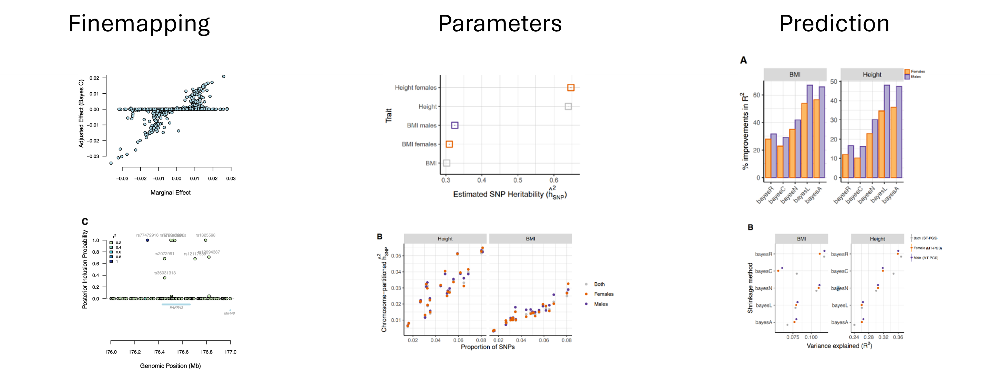

```{r setup, include=FALSE}
knitr::opts_chunk$set(echo = TRUE)
```

## Introduction
The challenge of understanding the biological basis of complex traits arises from several factors, including precise detection and quantification of the genetic associations. Statistical finemapping approaches enhance the precision of genetic associations by addressing the complexities posed by long-range linkage disequilibrium (LD) in genome-wide association studies (GWAS). These complexities consequently arise by leveraging millions of genetic variants in GWAS summary data, thereby increasing the need of intricate fine mapping approaches. Here we present the use of Bayesian linear regression (BLR) models for fine mapping approach using summary data. Allowing joint estimation of variants’ effects while accounting for LD among variants, our BLR models using Gibbs sampling technique, perform regularization and conduct variable selection. The BLR models have been applied in mapping genetic variants, estimating genetic parameters, prediction, but however, to our knowledge, only a few studies have investigated precision and power of the models in fine mapping approach. 

<br>

<div style="text-align: center;">

{width=75%}

</div>

<br>

This tutorial focus on fine-mapping using the Bayesian Linear Regression (BLR) model. It processes and analyzes GWAS (Genome-Wide Association Studies) summary statistics and employs fine-mapping on specific gene or genomic regions.

<br>

#### Prepare input data for finemapping 
```{r all-code, include=TRUE, eval=FALSE}
# Load libraries
library(qgg)
library(gact)

# Load GAlist
GAlist <- readRDS(file="C:/Users/gact/hsa.0.0.1/GAlist_hsa.0.0.1.rds")

# Check studies in gact database
GAlist$studies

# List BLR results files allready in gact database
list.files(GAlist$dirs["gbayes"])

# Load Glist with information on 1000G matched to the ancestry of GWAS data
Glist <- readRDS(file.path(GAlist$dirs["marker"],"Glist_1000G_eur_filtered.rds"))

# Select study
studyID <- "GWAS1"

# Extract GWAS summary statistics for GWAS1
stat <- getMarkerStat(GAlist=GAlist, studyID=studyID)

# Check and align summary statistics based on marker information in Glist
stat <- checkStat(Glist=Glist, stat=stat,
                  excludeMAF=0.05,
                  excludeMAFDIFF=0.05,
                  excludeINFO=0.8,
                  excludeCGAT=TRUE,
                  excludeINDEL=TRUE,
                  excludeDUPS=TRUE,
                  excludeMHC=FALSE,
                  excludeMISS=0.05,
                  excludeHWE=1e-12)
```

<br>

#### Finemapping of gene regions using Bayesian Linear Regression models 
```{r, include=TRUE, eval=FALSE}
# Extract gene-marker sets
sets <- getMarkerSets(GAlist = GAlist, feature = "Genesplus")

# Select gene regions to finemap
genes <- c("ENSG00000099204","ENSG00000118972", "ENSG00000145996","ENSG00000140718")

# Fine-mapping in selected gene regions using a Bayes R prior for the marker variance
fit <- gmap(Glist=Glist, stat=stat, sets=sets[genes], method="bayesR", algorithm="mcmc-eigen", eigen_threshold=c(0.995,0.99, 0.95, 0.9), verbose=TRUE)

# Posterior estimates of hyper-parameters (ve,vg,vb,pi,pip) for every fine-mapped region
head(fit$post)

# Convergence statistics for every fine-mapped region
head(fit$conv)

# Posterior estimates of marker effects for every fine-mapped region
head(fit$stat)

# Credible sets for every fine-mapped region
head(fit$cs)

# Bayesian false discovery rate sets for every fine-mapped region
head(fit$fdr)
```

<br>

#### Finemapping of LD regions using Bayesian Linear Regression models 
```{r, include=TRUE, eval=FALSE}

# Get LD scores 
ldscores <- getLDscores(Glist=Glist, chr=17)

# Create LD sets
sets <- createLDsets(ldscores=ldscores, 
                           maxsize=3000, msize=100, verbose=TRUE)

# Fine-mapping in LD regions using a Bayes R prior for the marker variance
fit <- gmap(Glist=Glist, stat=stat, sets=sets, 
            method="bayesR", algorithm="mcmc-eigen",
            nit=5000, nburn=1000, cs_threshold=0.5, cs_r2=0.5,
            eigen_threshold=c(0.99, 0.97,0.95,0.9), verbose=TRUE)

# Posterior estimates of hyper-parameters (ve,vg,vb,pi,pip) for every fine-mapped region
head(fit$post)

# Convergence statistics for every fine-mapped region
head(fit$conv)

# Posterior estimates of marker effects for every fine-mapped region
head(fit$stat)

# Credible sets for every fine-mapped region
head(fit$cs)

# Bayesian false discovery rate sets for every fine-mapped region
head(fit$fdr)


# Compute polygenic scores for finemapped regions
pgs <- gscore(Glist=Glist, stat=fit$stat)

```


<br>

#### Finemapping and polygenic scoring for LD regions using Bayesian Linear Regression models
```{r, include=TRUE, eval=FALSE}

# Get LD scores 
ldscores <- getLDscores(Glist=Glist, chr=17)

# Create LD sets
sets <- createLDsets(ldscores=ldscores, 
                           maxsize=3000, msize=100, verbose=TRUE)

# Fine-mapping in LD regions using a Bayes R prior for the marker variance
fit <- gmap(Glist=Glist, stat=stat, sets=sets, 
            method="bayesR", algorithm="mcmc-eigen",
            nit=5000, nburn=1000, cs_threshold=0.5, cs_r2=0.5,
            eigen_threshold=c(0.99, 0.97,0.95,0.9), verbose=TRUE)


# Compute polygenic scores for fine-mapped regions
pgs <- gscore(Glist=Glist, stat=fit$stat)

```


<br>

#### Examples of region-wide or genome-wide finemapping using simulated data 
```{r, include=TRUE, eval=FALSE}
library(qgg)

# Set working directory
setwd("C:/Users/Projects/Examples")

# Download simulated genotype data
url <- "https://github.com/psoerensen/qgdata/raw/main/simulated_human_data/human.bed"
download.file(url = url, mode = "wb", destfile = "human.bed")
url <- "https://github.com/psoerensen/qgdata/raw/main/simulated_human_data/human.bim"
download.file(url = url, destfile = "human.bim")
url <- "https://github.com/psoerensen/qgdata/raw/main/simulated_human_data/human.fam"
download.file(url = url, destfile = "human.fam")

# Prepare Glist
Glist <- gprep(study = "Simulation", 
               bedfiles = "C:/Users/Projects/Examples/human.bed", 
               bimfiles = "C:/Users/Projects/Examples/human.bim",
               famfiles = "C:/Users/Projects/Examples/human.fam")

# Filter markers
rsids <- gfilter(Glist = Glist, excludeMAF = 0.05, excludeMISS = 0.05,
                 excludeCGAT = TRUE, excludeINDEL = TRUE, excludeDUPS = TRUE, excludeHWE = 1e-12,
                 excludeMHC = FALSE)

# Compute sparse LD (this may take some time if R is not linked to openblas, atlas or MKL)
Glist <- gprep(Glist, task = "sparseld", msize = 1000, 
               rsids = rsids, 
               ldfiles = "C:/Users/Projects/Examples/human.ld",
               overwrite = TRUE)

# Simulate phenotype
sim <- gsim(Glist=Glist, rsids=rsids)

# Create sets surrounding each index SNPs
sets <- createMarkerSets(Glist=Glist, rsids=sim$causal)

# Linear model analyses and single marker association test
stat <- glma(y=sim$y,Glist = Glist, rsids=rsids)
```

<br>

##### Examples of region-wide or genome-wide finemapping using simulated data 
```{r, include=TRUE, eval=FALSE}

# Fine-mapping in selected genome regions using a Bayes C prior for the marker variance
fit <- gmap(Glist=Glist, stat=stat, sets=sets, method="bayesC", 
            algorithm="mcmc", output="full",verbose=TRUE)


# Posterior estimates of hyper-parameters (ve,vg,vb,pi,pip) for every fine-mapped region
head(fit$post)

# Convergence statistics for every fine-mapped region
head(fit$conv)

# Posterior estimates of marker effects for every fine-mapped region
head(fit$stat)

# Credible sets for every fine-mapped region
head(fit$cs)
```

<br>

##### Region-wide fine-mapping using simulated data 
```{r, include=TRUE, eval=FALSE}

# Fine-mapping using genome-wide approach using a Bayes C prior for the marker variance
fit <- gbayes(Glist=Glist, stat=stat, method="bayesC", 
            algorithm="mcmc", verbose=TRUE)

# Posterior estimates of hyper-parameters (ve,vg,vb,pi,pip) for chromosomes in Glist
head(fit$post)

# Convergence statistics for chromosomes in Glist
head(fit$conv)

# Posterior estimates of marker effects for chromosomes in Glist
head(fit$stat)

# Credible sets for every fine-mapped region defined by sets
fit$cs <- getCredibleSets(Glist=Glist, fit=fit, sets=sets)
head(fit$cs)

```
