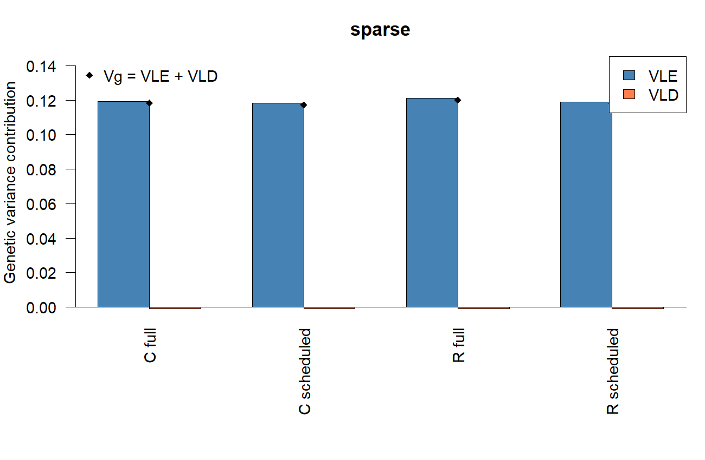
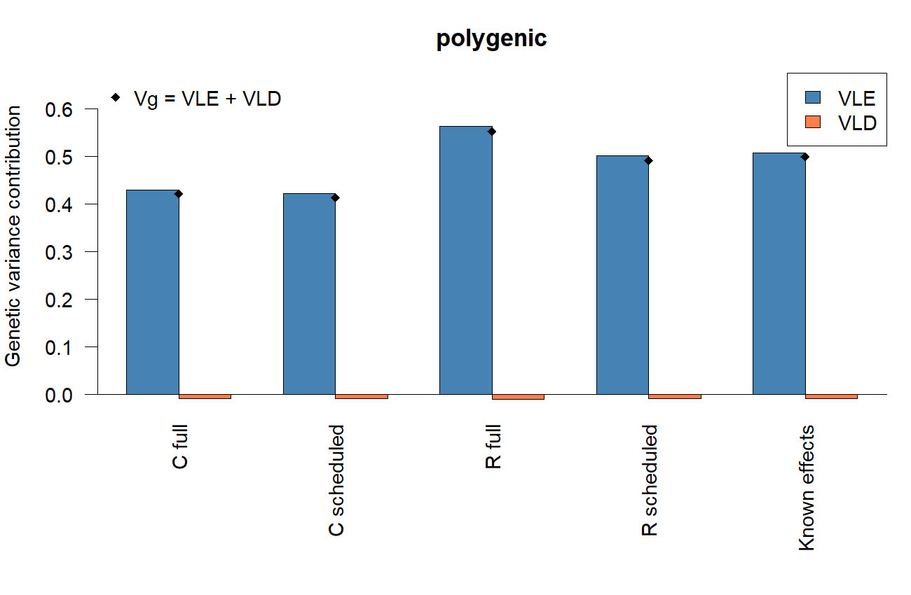
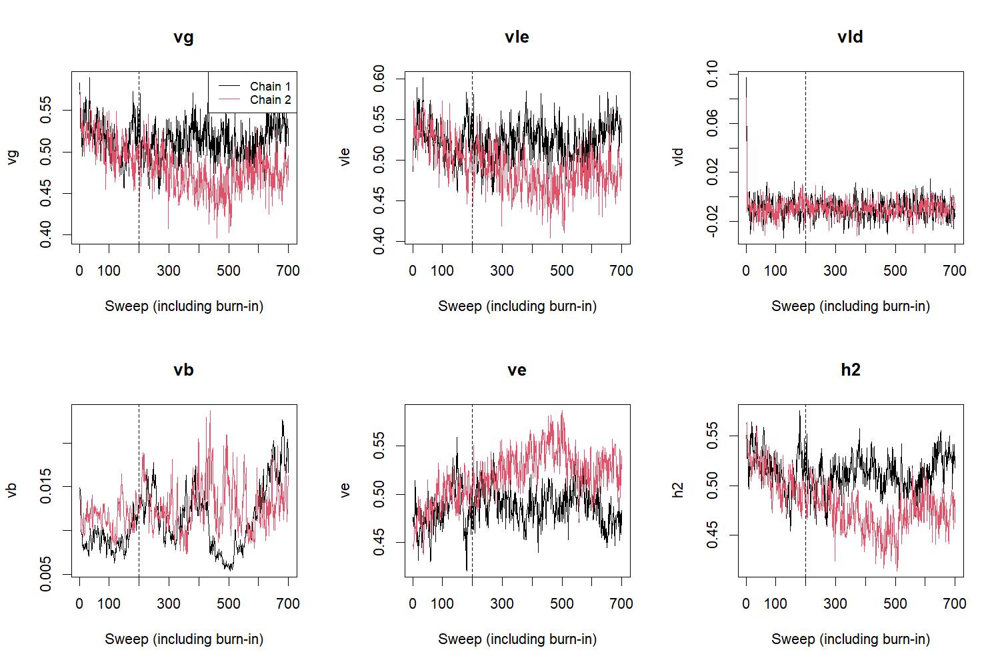
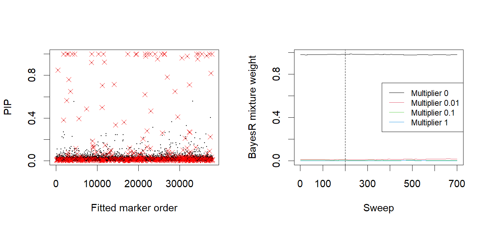

```{r setup, include=FALSE}
knitr::opts_chunk$set(echo=TRUE, eval=FALSE)
```

## Design

Fit **BayesC and BayesR**, each with ordinary full marker sweeps and with
scheduled marker updates. Reuse the simulated-human panel from the
[glma tutorial](Glma_linear_and_mixed_models_simulated_data.html): 5,000 people
and 50,000 original markers. Split people into 4,000 training and 1,000 test
samples before fitting. Run the four fits separately for the existing
four-causal-marker phenotype and a new 500-causal-marker phenotype.

The qgdata fileset is catalogued as `human_independent`; its original generation
seed and genome build are unrecorded. This example illustrates empirical
cross-marker variance contributions and does not establish behavior under
realistic population LD. The original PLINK files are reused unchanged.

The code below is a runnable analysis recipe. It requires a gbayes build exposing
`control$marker_schedule` and `fit$individual_bed$variance` (gbayes 0.1.2 or later).
Use the updated source package and compatible
gbase/gscore installations. The recorded run below completed all eight fits;
rendering the HTML reads saved summaries without rerunning the samplers.
These short teaching runs are not convergence qualification or a model ranking.

The marker scheduler skips some low-probability null-marker visits, updates
active/recent candidate markers, and periodically performs a full sweep.
This is an explicit approximation to ordinary full-sweep MCMC. Compare its
posterior summaries and predictions; identical seeds do not imply identical draws.

## Prepare the panel and split people

Use an existing working directory. Downloads are explicit and reuse files already
present. The corrected BIM changes invalid map values, preserving marker IDs,
positions, alleles and genotypes.

```{r prepare}
library(gbase)
library(gbayes)
library(gscore)

dir.create("gbayes-individual-example", showWarnings=FALSE)
setwd("gbayes-individual-example")
panel_url <- "https://github.com/psoerensen/qgdata/raw/main/simulated_human_data/"
example_url <- "https://psoerensen.github.io/gact/Document/glma-simulated-data/"
fetch <- function(url, file) {
  if (!file.exists(file)) download.file(url, file, mode="wb")
}
fetch(paste0(panel_url, "human.bed"), "human.bed")
fetch(paste0(example_url, "human.bim"), "human.bim")
fetch(paste0(panel_url, "human.fam"), "human.fam")
fetch(paste0(example_url, "example-phenotypes.csv"), "phenotypes.csv")
fetch(paste0(example_url, "causal-markers.txt"), "causal-markers.txt")

panel <- gprep(bedfiles="human.bed", bimfiles="human.bim", famfiles="human.fam")
phenotypes <- read.csv("phenotypes.csv", colClasses=c("character", "numeric"))
stopifnot(!anyDuplicated(phenotypes$id), setequal(phenotypes$id, panel$ids))
phenotypes <- phenotypes[match(panel$ids, phenotypes$id), ]
set.seed(20261009)
train_ids <- sample(panel$ids, 4000)
test_ids <- panel$ids[!panel$ids %in% train_ids]

# Marker QC uses training individuals, including their allele frequencies.
train_unfiltered <- gprep(bedfiles="human.bed", ids=train_ids)
markers <- gfilter(train_unfiltered, maf=.05, missing=.05, hwe=1e-12,
  ambiguous=TRUE, indels=TRUE, mhc=FALSE)
train <- gprep(bedfiles="human.bed", ids=train_ids, rsids=markers)
test <- gprep(bedfiles="human.bed", ids=test_ids, rsids=markers)
marker <- unlist(train$rsids, use.names=FALSE)
stopifnot(setequal(marker, unlist(test$rsids, use.names=FALSE)))
saveRDS(list(train_ids=train_ids, test_ids=test_ids, markers=marker), "split.rds")
```

Training-only QC may retain a different number from the 37,991 markers in the
earlier full-panel example. Report the observed count. Genotype standardization
in each fit uses training samples; scoring uses the frequencies saved in its
weights. Phenotype means/scales also come only from training samples.

## Add a moderately polygenic trait

Generate a second trait with 500 causal markers and three effect magnitudes.
The simulation uses all people to define a known-truth phenotype; model fitting
and tuning still see only training phenotypes. This is a teaching design, not
a draw from a fitted BayesR posterior. The original sparse phenotype retains
its original causal markers, which are checked against training QC.

```{r simulate}
set.seed(271828)
poly_causal <- sample(marker, 500)
effect_sd <- rep(sqrt(c(.01, .1, 1)), c(350, 125, 25))
truth_weights <- data.frame(
  marker=unlist(train$rsids, use.names=FALSE),
  chromosome=unlist(train$chr, use.names=FALSE),
  position=unlist(train$pos, use.names=FALSE),
  effect_allele=unlist(train$a1, use.names=FALSE),
  other_allele=unlist(train$a2, use.names=FALSE),
  allele_frequency=unlist(train$af, use.names=FALSE))
truth_weights$polygenic <- 0
truth_weights$polygenic[match(poly_causal, truth_weights$marker)] <-
  rnorm(500, sd=effect_sd)
all_selected <- gprep(bedfiles="human.bed", rsids=marker)
truth_score <- gscore(truth_weights, all_selected, scale_scores=FALSE)$scores[, 1]
truth_score <- truth_score[match(phenotypes$id, names(truth_score))]
stopifnot(all(is.finite(truth_score)))
g <- as.numeric(scale(truth_score)) * sqrt(.5)
genetic_scale <- sqrt(.5)/sd(truth_score)
genetic_intercept <- -mean(truth_score)*genetic_scale
truth_weights$polygenic <- truth_weights$polygenic*genetic_scale
e <- as.numeric(scale(rnorm(length(g)))) * sqrt(.5)
phenotypes$sparse <- phenotypes$phenotype
phenotypes$polygenic <- g + e
sparse_causal <- readLines("causal-markers.txt")
causal <- list(sparse=intersect(sparse_causal, marker), polygenic=poly_causal)
if (length(causal$sparse) != length(sparse_causal))
  warning("Training QC excluded an original causal marker; report this explicitly.")
truth <- list(weights=truth_weights, genetic=g, residual=e,
  genetic_intercept=genetic_intercept, genetic_scale=genetic_scale,
  target_component_variances=c(genetic=.5, residual=.5),
  realized_covariance=cov(g, e), causal=causal)
saveRDS(list(phenotypes=phenotypes, truth=truth), "phenotype-truth.rds")
```

The simulated components each have sample variance .5; their finite-sample
covariance need not be zero. The native genetic decomposition uses divisor
\(n\), whereas R's `var()` uses \(n-1\). Keep those denominators explicit when
comparing truth with fitted quantities.

## Fit the four models for each trait

Use lower-case method names with the individual-level interface. Starting
priors have the same nominal genetic variance under independent standardized
markers: \(m\pi V_b\) for BayesC and
\(m V_b\sum_k w_k\gamma_k\) for BayesR. This prior heuristic is distinct
from realized \(V_g\), which also reflects LD and empirical marker variances.

```{r fit}
schedule <- list(enabled=TRUE, full_sweep_every=10,
  base_interval=50, maximum_interval=200,
  candidate_threshold=.001, candidate_lifetime=20, burnin_only=FALSE)
base_control <- list(burnin=200, sampling_sweeps=500, thinning=5,
  seeds=c(17, 29), threads=2, retain_diagnostics=TRUE,
  likelihood_dimension=length(train_ids)-1,
  estimate_effect_variance=TRUE, estimate_residual_variance=TRUE,
  estimate_weights=TRUE)
fits <- list()
elapsed <- numeric()
phenotype_scaling <- list()
for (trait in c("sparse", "polygenic")) {
  y <- setNames(phenotypes[[trait]], phenotypes$id)
  center <- mean(y[train_ids]); scale_y <- sd(y[train_ids])
  phenotype_scaling[[trait]] <- c(center=center, scale=scale_y)
  data <- data.frame(id=train$study_ids,
    response=as.numeric((y[train$study_ids]-center)/scale_y))
  for (method in c("bayesc", "bayesr")) {
    pi <- if (trait == "sparse") 4/length(marker) else 500/length(marker)
    weights <- c(1-pi, .7*pi, .25*pi, .05*pi)
    gamma <- c(0, .01, .1, 1)
    vb <- .5/(length(marker)*if (method == "bayesc") pi else sum(weights*gamma))
    prior <- list(residual_variance=.5, effect_variance=vb,
      effect_variance_prior=list(df=4, scale=vb/2),
      residual_variance_prior=list(df=4, scale=.25),
      weight_prior=if (method == "bayesc") c(1, 1) else rep(1, 4))
    prior <- c(prior, if (method == "bayesc") list(inclusion_probability=pi) else
      list(weights=weights, variance_multipliers=gamma))
    for (updates in c("full", "scheduled")) {
      key <- paste(trait, method, updates, sep="_")
      control <- base_control
      control$marker_schedule <- if (updates == "scheduled") schedule else list(enabled=FALSE)
      cat("Fitting", key, "\n")
      elapsed[key] <- system.time(fits[[key]] <- gbayes(data=data, Glist=train,
        method=method, prior=prior, control=control, trait="response"))["elapsed"]
      saveRDS(fits[[key]], paste0(key, ".rds"))
    }
  }
}
saveRDS(list(fits=fits, elapsed=elapsed, scaling=phenotype_scaling,
  session=sessionInfo()), "analysis.rds")
```

These sweep counts are a starting point for a teaching run. Examine chain
agreement, R-hat, ESS, Monte Carlo error and traces before deciding whether
longer runs are needed. Known causal counts guide this simulation's starting
priors; real analyses must choose priors without held-out outcomes or known truth.
Elapsed time is measured on your machine, not a published speed benchmark.
The likelihood dimension subtracts the fitted training intercept. Phenotype-only
pre-adjustment for other covariates is not generally equivalent to a joint
covariate/genotype model.

## Variance decomposition and uncertainty

For each sampled effect vector \(b\), on the fitted training scale:

\[
V_g=\frac{\|Xb\|^2}{n},\quad
V_{\mathrm{LE}}=\frac{1}{n}\sum_j(x_j^\mathsf{T}x_j)b_j^2,\quad
V_{\mathrm{LD}}=V_g-V_{\mathrm{LE}}.
\]

\(V_{\mathrm{LE}}\) contains diagonal marker contributions. Native coding
uses training allele frequencies and Hardy-Weinberg scales, so empirical
\(x_j^\mathsf{T}x_j/n\) need not equal one. \(V_{\mathrm{LD}}\) contains
cross-marker contributions and can be negative; cancellation is meaningful.
\(V_b\) is the effect-distribution variance parameter, while \(V_e\) is
the residual variance parameter. BayesR non-null component variances are
\(\gamma_k V_b\), with separately learned mixture weights.

Use signed bars rather than treating every component as a positive fraction.
Native means average **all post-burnin sweeps**, independent of effect thinning.
Per-chain BED traces include burn-in and every sweep. Top-level traces average
chains at each sweep; for uncertainty and plotting, use the separate chains.
Pooled `final_*` values average
chain endpoints; they are not posterior means.

The polygenic simulation also supplies a known-effect reference. Use training
genotype counts and the same phenotype scale as the fits to compute its diagonal
contribution without decoding a dense genotype matrix:

```{r truth-variance}
p <- unlist(train$af, use.names=FALSE)
n0 <- unlist(train$n0, use.names=FALSE)
n1 <- unlist(train$n1, use.names=FALSE)
n2 <- unlist(train$n2, use.names=FALSE)
diagonal <- (n0*(0-2*p)^2+n1*(1-2*p)^2+n2*(2-2*p)^2) /
  (length(train_ids)*2*p*(1-p))
sy <- phenotype_scaling$polygenic["scale"]
b_true <- truth$weights$polygenic/sy
g_train <- truth$genetic[match(train_ids, phenotypes$id)]/sy
vg_true <- mean((g_train-mean(g_train))^2)
vle_true <- sum(diagonal*b_true^2)
truth_decomposition <- c(vg=vg_true, vle=vle_true, vld=vg_true-vle_true)
write.csv(data.frame(quantity=names(truth_decomposition),
  value=unname(truth_decomposition)), "polygenic-truth-variance.csv", row.names=FALSE)
truth_decomposition
```

This reference describes the realized training genotypes and known effects,
not a posterior draw or a population LD parameter. The sparse trait's original
effect sizes are not supplied, so it has no invented known-effect decomposition.

```{r variance-summaries}
variance_draws <- function(fit) {
  do.call(rbind, lapply(seq_along(fit$chains), function(k) {
    v <- fit$chains[[k]]$individual_bed
    stopifnot(isTRUE(v$available))
    draws <- data.frame(chain=k, sweep=seq_along(v$vg_trace),
      vg=v$vg_trace, vle=v$vle_trace, vld=v$vld_trace,
      vb=v$vb_trace, ve=v$ve_trace)
    draws <- draws[draws$sweep > fit$control$burnin, ]
    draws$h2 <- draws$vg/(draws$vg+draws$ve)
    draws
  }))
}
variance_summary <- do.call(rbind, lapply(names(fits), function(key) {
  d <- variance_draws(fits[[key]])
  do.call(rbind, lapply(c("vg", "vle", "vld", "vb", "ve", "h2"), function(q) {
    data.frame(fit=key, quantity=q, mean=mean(d[[q]]),
      lower=unname(quantile(d[[q]], .025)), upper=unname(quantile(d[[q]], .975)))
  }))
}))
write.csv(variance_summary, "variance-summary.csv", row.names=FALSE)
variance_summary

key <- "polygenic_bayesr_scheduled"
fit <- fits[[key]]
png("variance-traces.png", width=1500, height=1000, res=150, pointsize=16)
par(mfrow=c(2, 3))
for (q in c("vg", "vle", "vld", "vb", "ve", "h2")) {
  chains <- lapply(fit$chains, function(ch) {
    v <- ch$individual_bed
    if (q == "h2") v$vg_trace/(v$vg_trace+v$ve_trace) else v[[paste0(q, "_trace")]]
  })
  matplot(do.call(cbind, chains), type="l", lty=1, col=seq_along(chains),
    xlab="Sweep (including burn-in)", ylab=q, main=q)
  abline(v=fit$control$burnin, lty=2)
  if (q == "vg") legend("topright", paste("Chain", seq_along(chains)),
    col=seq_along(chains), lty=1, cex=.8)
}
par(mfrow=c(1, 1))
dev.off()

for (trait in c("sparse", "polygenic")) {
  keys <- names(fits)[startsWith(names(fits), paste0(trait, "_"))]
  decomposition <- sapply(fits[keys], function(f)
    unlist(f$individual_bed$variance[c("mean_vle", "mean_vld")]))
  labels <- sub(paste0(trait, "_"), "", keys)
  labels <- sub("bayesc_", "C ", labels)
  labels <- sub("bayesr_", "R ", labels)
  if (trait == "polygenic") {
    decomposition <- cbind(decomposition,
      known_effects=unname(truth_decomposition[c("vle", "vld")]))
    labels <- c(labels, "Known effects")
  }
  bounds <- range(0, decomposition, colSums(decomposition))
  if (diff(bounds) == 0) bounds <- c(-1, 1)
  png(paste0(trait, "-variance-decomposition.png"), width=1300, height=850, res=150, pointsize=14)
  par(mar=c(8, 4, 3, 1))
  bar_x <- barplot(decomposition, beside=TRUE, names.arg=labels,
    col=c("steelblue", "coral"), ylim=bounds*1.2, las=2,
    ylab="Genetic variance contribution", main=trait)
  abline(h=0)
  points(colMeans(bar_x), colSums(decomposition), pch=18)
  legend("topright", c("VLE", "VLD"), fill=c("steelblue", "coral"))
  legend("topleft", "Vg = VLE + VLD", pch=18, bty="n")
  dev.off()
}
```

The displayed 95% intervals are marginal empirical posterior quantiles, not
Monte Carlo error intervals. \(h^2=V_g/(V_g+V_e)\) is calculated at each draw;
its posterior mean is generally different from the ratio of posterior means.
This model-scale quantity is not automatically \(V_g/\operatorname{var}(y)\).
Likewise, variance of the posterior mean score differs from posterior mean
genetic variance. If partitioning markers by chromosome/pathway, include
cross-group covariances before interpreting a sum as total genetic variance.

## Marker support, mixture weights and diagnostics

```{r marker-diagnostics}
for (key in names(fits)) {
  fit <- fits[[key]]
  trait <- strsplit(key, "_", fixed=TRUE)[[1]][1]
  cat("\n", key, "\n")
  print(fit$posterior)  # Native statuses, R-hat, ESS and MCSE.
    print(fit$parameter_mean$weights)
    if (fit$method == "bayesr")
      print(data.frame(multiplier=fit$prior$variance_multipliers,
        effect_variance=fit$prior$variance_multipliers*fit$parameter_mean$effect_variance))
  print(fit$estimates[fit$estimates$marker %in% causal[[trait]],
    c("marker", "mean", "pip")])
  print(lapply(fit$chains, function(ch) ch[c("scheduled_marker_updates",
    "scheduled_full_sweeps")]))
}
fit <- fits$polygenic_bayesr_scheduled
png("marker-mixture-diagnostics.png", width=1400, height=650, res=150, pointsize=14)
par(mfrow=c(1, 2))
plot(fit$estimates$pip, pch=20, cex=.4, xlab="Fitted marker order", ylab="PIP")
at <- match(causal$polygenic, fit$estimates$marker)
points(at, fit$estimates$pip[at], col="red", pch=4)
w <- do.call(rbind, fit$chains[[1]]$individual_bed$weight_trace)
matplot(w, type="l", lty=1, xlab="Sweep", ylab="BayesR mixture weight")
abline(v=fit$control$burnin, lty=2)
legend("right", paste("Multiplier", fit$prior$variance_multipliers),
  col=seq_len(ncol(w)), lty=1, cex=.8)
par(mfrow=c(1, 1))
dev.off()
```

PIPs identify marginal marker support; LD can spread support across correlated
markers. BayesR component probabilities are in `fit$component_probability`,
with columns corresponding to the prior multipliers, including the null component.
Scheduled global mixture weights update on full sweeps. Fixed/not-retained
diagnostic statuses and short-chain R-hat/ESS must be read explicitly; a finite
diagnostic alone does not establish convergence. BED `log_cpo` and
`mean_log_cpo` summarize training conditional predictive ordinates using
retained draws; they are distinct from held-out prediction accuracy.
The top-level CPO fields average the native per-chain reports.

## Held-out prediction

Apply posterior mean weights with training coding and **without rescaling scores
across test samples**. Convert the score back to original phenotype units using
only the training mean and standard deviation. Do not choose priors or scheduling
settings using these final test outcomes.

```{r prediction}
comparison <- do.call(rbind, lapply(names(fits), function(key) {
  fit <- fits[[key]]
  trait <- strsplit(key, "_", fixed=TRUE)[[1]][1]
  prediction <- gscore(fit$weights, test, scale_scores=FALSE)
  training_score <- gscore(fit$weights, train, scale_scores=FALSE)$scores[, 1]
  score <- prediction$scores[, 1]
  ids <- rownames(prediction$scores)
  scaling <- phenotype_scaling[[trait]]
  predicted <- scaling["center"] + scaling["scale"]*score
  observed <- phenotypes[[trait]][match(ids, phenotypes$id)]
  write.csv(data.frame(id=ids, observed=observed, predicted=predicted),
    paste0(key, "-predictions.csv"), row.names=FALSE)
  v <- fit$individual_bed$variance
  d <- variance_draws(fit)
  visits <- if (fit$control$marker_schedule$enabled)
    sum(vapply(fit$chains, function(ch) ch$scheduled_marker_updates, 0)) /
      (length(fit$chains)*length(marker)*(fit$control$burnin+fit$control$sampling_sweeps)) else 1
  data.frame(fit=key, correlation=cor(observed, predicted),
    rmse=sqrt(mean((observed-predicted)^2)), seconds=unname(elapsed[key]),
    vg=v$mean_vg, vle=v$mean_vle, vld=v$mean_vld,
    vg_posterior_mean_score=mean(training_score^2),
    vb=mean(d$vb), ve=mean(d$ve), h2=mean(d$h2), fraction_marker_visits=visits,
    active_retained=mean(vapply(fit$chains, function(ch) mean(ch$trace[, "active_markers"]), 0)))
}))
write.csv(comparison, "fit-comparison.csv", row.names=FALSE)
comparison
```

Compare full and scheduled fits within each model and phenotype, considering
Monte Carlo uncertainty and chain agreement alongside prediction. A favourable
runtime or correlation in this one simulation does not establish general
equivalence or superiority. The saved split, phenotype truth, fits, weights,
summaries and session information make the analysis inspectable and reusable.

## Recorded short-run results

The 9 October 2026 run retained 37,994 markers after training-only QC. Each fit
used two chains, 200 burn-in sweeps and 500 sampling sweeps, thinning effects
every five sweeps. Timing covers the `gbayes()` call, including native BED
preparation, and excludes downloads and subsequent scoring.

```{r recorded-prediction, echo=FALSE, eval=TRUE, purl=FALSE}
recorded <- read.csv("gbayes-individual-data/fit-comparison.csv")
knitr::kable(recorded[c("fit", "correlation", "rmse", "seconds",
                       "fraction_marker_visits")], digits=3)
```

Scheduling used about 10–11% of full-sweep marker visits for the sparse trait
and 37% for polygenic BayesC. Polygenic BayesR kept every marker hot at the
chosen threshold: it visited 100% of markers and took 420 seconds versus
412 seconds for full sweeps. Scheduling therefore provided no speed gain in
that fit. Similar held-out correlations do not establish posterior equivalence.

```{r recorded-variance, echo=FALSE, eval=TRUE, purl=FALSE}
knitr::kable(recorded[c("fit", "vg", "vle", "vld",
                       "vg_posterior_mean_score", "ve", "h2")], digits=4)
```

Posterior mean VG differs from the variance of scores computed using posterior
mean effects. The polygenic known-effect reference on the training/model scale
is VG = 0.4991, VLE = 0.5077 and VLD = −0.0087. Negative VLD is valid: it
represents the summed cross-marker contribution in this particular panel.









```{r recorded-diagnostics, echo=FALSE, eval=TRUE, purl=FALSE}
d <- read.csv("gbayes-individual-data/posterior-diagnostics.csv")
diagnostic_summary <- do.call(rbind, lapply(split(d, d$fit), function(x)
  data.frame(fit=x$fit[1], max_rhat=max(x$rhat, na.rm=TRUE),
             min_ess_bulk=min(x$ess_bulk, na.rm=TRUE))))
knitr::kable(diagnostic_summary, digits=3, row.names=FALSE)
```

Several fits have poor chain agreement at this run length. Treat their variance
summaries and figures as provisional illustrations, and inspect per-chain
traces and diagnostics before interpreting differences between methods.
The optional continuation below shows how to extend a selected run.

Saved public evidence includes [fit summaries](gbayes-individual-data/fit-comparison.csv),
[variance intervals](gbayes-individual-data/variance-summary.csv),
[full diagnostics](gbayes-individual-data/posterior-diagnostics.csv),
[run settings](gbayes-individual-data/run-record.json) and
[input checksums](gbayes-individual-data/input-checksums.json).

## Extend a short run from saved state

Repeat the training data, prior and transition settings when continuing a
selected fit. The native scheduler queue and RNG state are restored. The
following optional extension is not part of the recorded eight-fit comparison:

```{r continue, eval=FALSE, purl=FALSE}
key <- "polygenic_bayesr_scheduled"
old <- fits[[key]]
scaling <- phenotype_scaling$polygenic
y <- setNames(phenotypes$polygenic, phenotypes$id)
training_data <- data.frame(id=train$study_ids,
  response=as.numeric((y[train$study_ids]-scaling["center"])/scaling["scale"]))
control <- old$control
control$burnin <- 0
control$sampling_sweeps <- 2000
extended <- gbayes(data=training_data, Glist=train, method=old$method,
  trait=old$trait, prior=old$prior, control=control, continuation=old)
extended$posterior
saveRDS(extended, paste0(key, "-continued.rds"))
```

Continuation summaries and traces cover the new batch; they do not combine
previous posterior summaries automatically. Scheduling counters are cumulative
from the start of each chain. Compare the new per-chain traces and diagnostics
before treating longer execution as evidence of adequate mixing.
