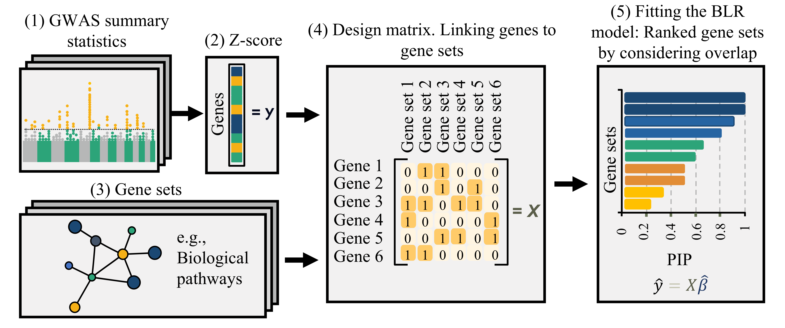

```{r setup, include=FALSE}
knitr::opts_chunk$set(echo = TRUE)
```

## Introduction
Here we introduce Bayesian Polygenic Priority Score (Bayesian PoPS) which is a method for prioritizing genes based on polygenic signals from genome-wide association studies (GWAS). By integrating GWAS summary statistics with functional genomic data, PoPS identifies genes most likely involved in complex traits or diseases. This approach leverages the polygenic nature of traits, considering many genetic variants across the genome, and scores genes based on their likelihood of contributing to the trait. PoPS is valuable for focusing research on genes with potential biological relevance, facilitating more targeted follow-up studies in complex trait genomics.

The figure below presents a schematic overview of the workflow. In the initial step, GWAS summary data for the traits of interest are utilized to compute gene-level Z-scores using the VEGAS (Versatile Gene-Based Association Study) approach ([Gene analysis using VEGAS](Gene_analysis_vegas.html)). Next a design matrix linking genes to gene sets to integrate curated gene sets is constructed. The Bayesian PoPS model is then fitted using this design matrix of all gene sets as input features (predictors) and the Z-scores as the response variable. The predicted genes values, $\hat{y} = X\hat{\beta}$, are the polygenic scores. 

<br>

<div style="text-align: center;">

{width=75%}

</div>

<br>

This tutorial demonstrates the Polygenic Priority Scoring (PoPS) procedure to prioritize genes associated with complex traits using polygenic signals from genome-wide association studies (GWAS). It is based on gene-level statistics from VEGAS and gene sets from Reactome pathways. Using these data, the tutorial applies different PoPS methods: ridge regression (RR) for regularized linear modeling, and Bayesian approaches (BayesC and BayesR) that employ different priors to capture polygenic effects. The computed scores highlight genes likely relevant to the trait of interest, providing insights for further biological investigation.

<br>

#### Prepare input data for Polygenic Priority Scoring 
```{r, include=TRUE, eval=FALSE}
# Load libraries
library(qgg)
library(gact)

# Load GAlist with information on gact database
GAlist <- readRDS(file="C:/Users/gact/hsa.0.0.1/GAlist_hsa.0.0.1.rds")

# Check studies in gact database
GAlist$studies

# Select GWAS study IDs
studyIDs <- "GWAS1"

# Get VEGAS gene-level statistics (i.e. z-statistics)
stat <- getVEGAS(GAlist=GAlist, studyID=studyIDs)

# Get gene sets for Reactome pathways
sets <- getFeatureSets(GAlist = GAlist, feature = "Pathways", minsets=50)
```

<br>

#### Polygenic Priority Scoring using different methods
```{r, include=TRUE, eval=FALSE}
# POPS based on linear model, thresholding and ridge regression (Original PoPS)
scoreRR <- pops(stat=stat, sets=sets, method="rr",
              threshold=0.05)
head(scoreRR)

# POPS based on linear model and BLR using BayesC prior
scoreC <- pops(stat=stat, sets=sets, method="bayesC",
             pi=0.001, nit=5000, nburn=1000)
head(scoreC)

# POPS based on linear model and BLR using BayesR prior
scoreR <- pops(stat=stat, sets=sets, method="bayesR",
             pi=0.001, nit=5000, nburn=1000)
head(scoreR)
```
