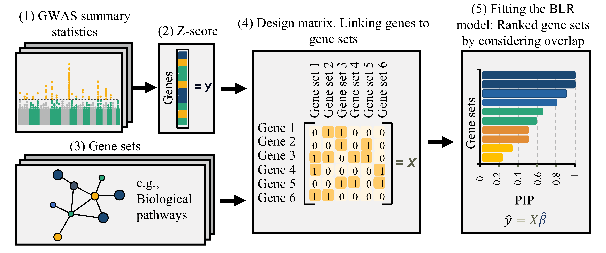

```{r setup, include=FALSE}
knitr::opts_chunk$set(echo = TRUE)
```

## Introduction
Here we introduce Bayesian MAGMA - a gene-set prioritization approach utilizing Bayesian Linear Regression (BLR) models within the MAGMA gene-set analysis procedure. The figure below presents a schematic overview of the workflow. In the initial step, GWAS summary data for the traits of interest are utilized to compute gene-level Z-scores using the VEGAS (Versatile Gene-Based Association Study) approach ([Gene analysis using VEGAS](Document/Gene_analysis_vegas.html)). Next a design matrix linking genes to gene sets to integrate curated gene sets is constructed. The Bayesian MAGMA model is then fitted using this design matrix of all gene sets as input features (predictors) and the Z-scores as the response variable. This results in a posterior inclusion probability (PIP) for each gene set, which represents the probability that the gene set is included in the model. Gene sets with higher PIPs are given higher priority scores, facilitating the identification of potential biological mechanisms underlying the observed genetic associations. We have also extended, our methodology to a multiple-trait analysis, enabling a comprehensive exploration of gene sets across diverse traits. See details on the statistical model and analyses, the VEGAS approach, and the used data are provided in our accompanying paare provided in the following paper in Gholipourshahraki et al. 2024. 

<br>

<div style="text-align: center;">

{width=75%}

</div>

<br>

This tutorial is designed for advanced gene set analysis, utilizing a variety of tools and methodologies. Its primary focus lies in the integration and assessment of gene-marker sets, along with a detailed exploration of gene-disease associations derived from text mining, knowledge bases, and experimental data. The analysis utilizes gene-marker relationships, gene-level statistics, and gene-disease associations to conduct comprehensive gene set evaluations. This allow an in-depth analysis helping interpreting and validating genomic associations.

<br>

#### Prepare for Bayesian MAGMA gene set analysis 
```{r, include=TRUE, eval=FALSE}
# Load libraries
library(qgg)
library(gact)

# Load GAlist with information on gact database
GAlist <- readRDS(file="C:/Users/gact/hsa.0.0.1/GAlist_hsa.0.0.1.rds")

# Check studies in gact database
GAlist$studies

# Get gene sets for KEGG pathways
sets <- getFeatureSets(GAlist = GAlist, feature="KEGG", minsets=50)
```

<br>

#### Bayesian MAGMA gene set analysis for a single trait (T2D from EUR)
```{r, include=TRUE, eval=FALSE}
# Select GWAS study IDs
studyID <- "GWAS1"

# Get VEGAS gene-level statistics (i.e. z-statistics)
stat <- getVEGAS(GAlist=GAlist, studyID=studyID)
head(stat)

# Bayesian MAGMA based on single trait BLR model
fit <- magma(stat=stat, sets=sets, method="bayesC",
             pi=0.01, nit=5000, nburn=1000)
head(fit)

# MAGMA based on linear model  using a joint test for features (default MAGMA method)
fit <- magma(stat=stat, sets=sets, type="joint")
head(fit)

# MAGMA based on linear model using a marginal test for each feature
fit <- magma(stat=stat, sets=sets, type="marginal")
head(fit)
```

<br>

#### Multiple trait Bayesian MAGMA gene set analysis (T2D and CAD from EUR)
```{r, include=TRUE, eval=FALSE}
# Select GWAS study IDs
studyIDs <- c("GWAS1","GWAS2")

# Get VEGAS gene-level statistics (i.e. z-statistics)
stat <- getVEGAS(GAlist=GAlist, studyID=studyIDs)
head(stat)

# Bayesian MAGMA based fitting a multiple trait model
fit <- magma(stat=stat, sets=sets, method="bayesC",
             pi=0.01, nit=1000, nburn=200)
str(fit)
head(fit$PIP)
```

<br>

#### Multiple trait Bayesian MAGMA gene set analysis (T2D from EUR, EAS and SAS)
```{r, include=TRUE, eval=FALSE}
# Select GWAS study IDs
studyIDs <- c("GWAS6","GWAS7","GWAS8")

# Get VEGAS gene-level statistics (i.e. z-statistics)
stat <- getVEGAS(GAlist=GAlist, studyID=studyIDs)
head(stat)

# Bayesian MAGMA based fitting a multiple trait model
fit <- magma(stat=stat, sets=sets, method="bayesC", pi=0.01, nit=1000, nburn=200)
str(fit)
head(fit$b)
head(fit$PIP)
```
