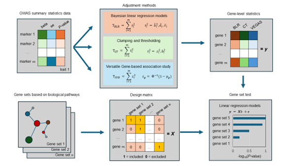

```{r setup, include=FALSE}
knitr::opts_chunk$set(echo = TRUE)
```

# Introduction
The MAGMA (Multi-marker Analysis of Genomic Annotation) approach is a widely used gene set test that leverages a linear regression framework to evaluate gene sets' collective impact on a trait. By aggregating marker-level association statistics within each gene and adjusting for linkage disequilibrium (LD), MAGMA produces gene-level statistics. In the model, gene-level statistics are the dependent variable, while gene sets (indicated by a binary membership matrix) are independent variables. Regression coefficients reveal each gene set's association strength with traits, with significance assessed via standard tests. Gene-level statistics can be computed using $T_{BLR}$ (BLR model-based), $T_{CT}$ (clumping and thresholding), and $T_{SVD}$ (eigenvalue-decomposition of the LD matrix). Workflow of the marker set tests implemented are shown in the figure below. (1) Get GWAS summary statistics data from genotypes and phenotypes. (2) Calculate gene-level statistics using different methods. (3) Create gene sets based on biological gene sets. (4) Design matrix to link genes to gene sets. (5) Combine gene sets and adjusted marker effects for genes to perform gene set test analysis using linear regression models

<br>

<div style="text-align: center;">

{width=75%}
</div>

<br>

This script facilitates advanced gene set analysis, integrating gene-marker sets and exploring gene-disease associations from text mining, knowledge bases, and experimental data. By combining gene-marker relationships, gene-level statistics, and gene-disease associations, it enables a comprehensive evaluation to interpret and validate genomic associations.

<br>

#### MAGMA gene set analysis using BLR derived gene-level statistics 
```{r, include=TRUE, eval=FALSE}
# Load libraries
library(qgg)
library(gact)
library(data.table)

# Load GAlist with information on gact database
GAlist <- readRDS(file="C:/Users/gact/hsa.0.0.1/GAlist_hsa.0.0.1.rds")

# Select study
studyID <- "GWAS2"

# Get BLR marker-level statistics (i.e. posterior means of b, d and v)
stat <- getBLR(GAlist=GAlist, studyID=studyID)
head(stat)

# Extract gene-marker sets
msets <- getMarkerSets(GAlist = GAlist, feature = "Genesplus")

# Compute gene-level statistics from BLR marker-level statistics
msets <- mapSetsDB(sets=msets,featureID=stat$rsids,index=TRUE)
bstat <- sapply(msets,function(x){sum(abs(stat$bm[x]))})
dstat <- sapply(msets,function(x){sum(abs(stat$dm[x]))})
vstat <- sapply(msets,function(x){sum(abs(stat$vm[x]))})

# Get gene sets for KEGG pathways
sets <- getFeatureSets(GAlist = GAlist, feature="KEGG", minsets=50)

# MAGMA based on linear model  using a joint test for features (default MAGMA method)
fitB <- magma(stat=bstat, sets=sets, type="joint")
fitD <- magma(stat=dstat, sets=sets, type="joint")
fitV <- magma(stat=vstat, sets=sets, type="joint")
head(fitB)
head(fitD)
head(fitV)
```

<br>

#### MAGMA marker set analysis leveraging GTEx eQTL marker sets 
```{r, include=TRUE, eval=FALSE}
# Select study
studyID <- "GWAS2"

# Get BLR marker-level statistics (i.e. posterior means of b, d and v)
stat <- getBLR(GAlist=GAlist, studyID=studyID)
head(stat)

# Extract marker sets derived from eQTLs
sets <- getMarkerSetsDB(GAlist = GAlist, feature = "GTExV8", threshold=0.01)

# MAGMA based on linear model  using a joint test for features (default MAGMA method)
fitGTEx <- magma(stat=stat["dm"], sets=sets, type="joint")
head(fitGTEx)
```

<br>

#### MAGMA marker set analysis leveraging regulatory marker sets from ENSEMBL 
```{r, include=TRUE, eval=FALSE}
# Select study
studyID <- "GWAS2"

# Get BLR marker-level statistics (i.e. posterior means of b, d and v)
stat <- getBLR(GAlist=GAlist, studyID=studyID)
head(stat)

# Extract marker sets derived from regulatory genomic features
sets <- getMarkerSetsDB(GAlist = GAlist, feature = "Regulatory Categories")

# MAGMA based on linear model  using a joint test for features (default MAGMA method)
fitREG <- magma(stat=stat["dm"], sets=sets, type="joint")
head(fitREG)
```
