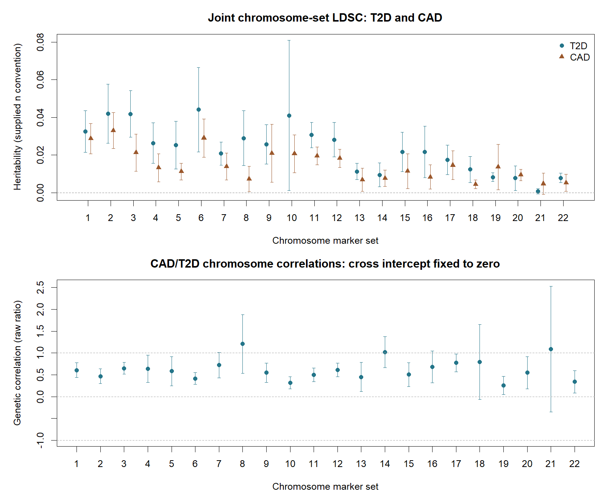
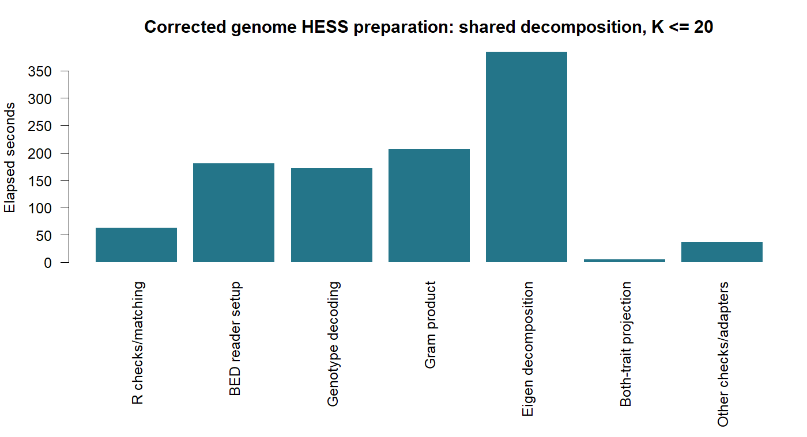
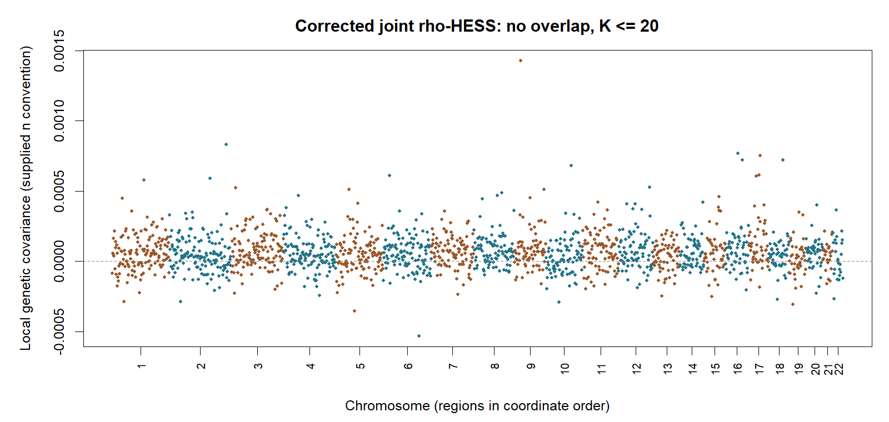

```{r setup, include=FALSE}
knitr::opts_chunk$set(echo=TRUE,eval=FALSE)
```

## Reuse the database and reference

This example uses the **standalone gcorr R package** from the gsuite ecosystem
with the existing gact CAD/T2D database. Genome-wide LDSC, GNOVA and an
illustrative SumHer baseline reuse the stored EUR LD scores. Regional
HESS/rho-HESS reads the existing BED genotypes one region at a time. It
decomposes LD, projects both traits and discards the large matrices and
eigenvectors before proceeding to the next region. **No genome-wide LD files
or persistent eigenvector cache are created.**

| Study | Trait | Recorded participants | Cases | Controls |
| --- | --- | ---: | ---: | ---: |
| GWAS1 ([Mahajan et al., 2018](https://pubmed.ncbi.nlm.nih.gov/30297969/)) | T2D without UK Biobank | 456,236 | 55,927 | 400,309 |
| GWAS2 ([Nikpay et al., 2015](https://pubmed.ncbi.nlm.nih.gov/26343387/)) | CAD | 184,305 | 60,801 | 123,504 |

The existing EUR reference has **503 people** and GRCh37 coordinates. The
reference BIM position of rs429358, chr19:45,411,941, agrees with the
[NCBI GRCh37 example](https://www.ncbi.nlm.nih.gov/variation/view/help/).
The CAD meta-analysis includes multiple ancestries; this EUR-reference example
does not establish a perfectly ancestry-matched CAD analysis.

The workflow retains **the extracted `stat$n`**, exactly as the qgg example
does. For these database files, `n` is absent from the raw summaries, so
`getMarkerStat()` supplies study metadata `neff`: 49,071.273294961 for GWAS1
and 40,743.152404981 for GWAS2. Binary-study metadata uses
`Ncase*Ncontrol/(Ncase+Ncontrol)`. Ingestion can also infer a missing summary
field from `round(median(1/(2*af*(1-af)*seb^2)))`. Existing marker-specific
values are retained; no total-participant or factor-four substitution is made.
These are results under the database information-size convention; no population
prevalence or liability transformation is inferred.

**Correction on 7 October:** the initial gcorr adapter substituted total
participants and added an unrelated QC mask. This version follows the website's
[reference preparation](https://psoerensen.github.io/gact/Document/Process_1000G.html)
and [LD-score workflow](https://psoerensen.github.io/gact/Document/Compute_sparseLD_1000G.html):
filter BED to `GAlist$rsids`, then use the markers in the filtered Glist.
Only common reference/summary/LD-score rows are selected for these analyses.
No additional MAF, missingness, HWE, palindromic-allele, indel or
duplicate-position filter is applied. Original `stat$n` is retained.

The ordinary LDSC example applies the same default squared-Z threshold as
qgg (80 for these information sizes); chromosome-set LDSC applies no such
threshold, matching the website's qgg set branch. Set contributions are
normalized by matched set membership. The gcorr joint ordinary fit uses one
common marker-universe count; qgg's univariate fits use their separate counts
after filtering. gcorr retains its regression weighting and block jackknife;
qgg's regression is unweighted. These are disclosed estimator differences,
rather than extra reference filters.

## Inputs and QC

Use compatible development installations of gbase and **R/native gcorr 0.1.1**.
The new preparation functions require this development version; update an older
installation before running the example.
See the [standalone installation guide](https://psoerensen.github.io/gtools/gsuite/docs/source-package-repository.html).
The code below requires your existing gact descriptor and a gbase-prepared
Glist. If your saved reference is a qgg Glist, prepare a gbase descriptor from
the same BED/BIM/FAM files once; no genotype download or sparse LD is needed.

```{r packages-and-reference}
library(gact)
library(gbase)
library(gcorr)
gcorr::gcorr_native_info()

GAlist <- readRDS("path/to/GAlist_hsa.0.0.1.rds")
Glist <- readRDS("path/to/Glist_1000G_eur_filtered.rds")
if (!inherits(Glist,"gs_genotypes")) {
  Glist <- gbase::gprep(bedfiles=Glist$bedfiles,
    bimfiles=Glist$bimfiles,famfiles=Glist$famfiles)
}
```

Download only the small LD-boundary table and preparation helper if needed.
The [HESS input guide](https://huwenboshi.github.io/hess/input_format/)
recommends approximately independent regions matched to the ancestry. We use
the published Berisa/Pickrell EUR boundaries at a pinned revision, with
start-inclusive/stop-exclusive coordinates, rather than small arbitrary
windows. Region independence remains a modeling approximation.

```{r small-workflow-files}
work <- file.path(path.expand("~"),"gact-gcorr-example")
dir.create(work,recursive=TRUE,showWarnings=FALSE)
base <- "https://psoerensen.github.io/gact/Document/data/"
for (name in c("EUR-fourier-ac125e47.bed","gcorr_cad_t2d_example.R",
               "gcorr_set_scores.R")) {
  destination <- file.path(work,name)
  if(!file.exists(destination)) download.file(paste0(base,name),destination,mode="wb")
}
source(file.path(work,"gcorr_cad_t2d_example.R"))
source(file.path(work,"gcorr_set_scores.R"))
input <- prepare_gcorr_cad_t2d(GAlist,Glist,
  file.path(work,"EUR-fourier-ac125e47.bed"))
```

The helper reuses `Glist$ldscores` when present. Otherwise it reads the existing
ordinary scores with `gact::getLDscoresDB()`. It never computes new scores.
Both traits use the reference selected to database marker IDs by the
website's `writeBED(..., rsids=GAlist$rsids)` step. The analysis selects common
reference/summary/LD-score rows without any further genotype QC exclusions.
The recorded availability mask retains the common rows of GWAS1, GWAS2 and
GWAS6 used by the existing gact LDSC example; GWAS6 contributes only to that
mask. The helper's `common_study_ids` argument makes this choice explicit.
The stored database scores may include markers absent from the current BED;
their excluded count is recorded by the input audit. Database Z scores are
explicitly oriented to BIM allele 1, including palindromic alleles with known
database/reference labels. Region members are disjoint marker IDs; duplicate
positions are retained and uncovered positions are counted.

| qc | count |
| --- | --- |
| reference_markers | 9,985,562 |
| regression_markers | 7,221,923 |
| regional_markers | 7,221,923 |
| regions | 1,702 |
| unpartitioned_markers | 0 |

Website-filter audit:

| check | count |
| --- | --- |
| reference_markers | 9,985,562 |
| common_database_score_rows | 7,221,923 |
| matched_reference_summary_score_rows | 7,221,923 |
| retained_maf_le_0.05 | 2,358,470 |
| retained_palindromic | 1,083,607 |
| retained_duplicated_positions | 0 |

## Genome-wide fits with stored LD scores

The current table reports **corrected LDSC, GNOVA and SumHer** using the same
website marker selection and extracted `stat$n`. The earlier total-participant
results and the sample-size-only diagnostic are superseded and preserved
separately. The completed GNOVA rerun reuses the corrected saved LDSC cross
intercept; its checksum and value are recorded with the run.

LDSC estimates marginal and cross-trait intercepts. Ordinary GNOVA conditions
on that fitted cross intercept; uncertainty in estimating this nuisance input
is not propagated. SumHer uses an **illustrative equal-marker baseline** with
the stored ordinary scores for architecture and tagging. This is not a
MAF/LD-weighted LDAK architecture or a software comparison with LDAK.
SumHer estimates multiplicative marginal scalings and a cross-trait Z-product
intercept. The corrected CAD scaling is about 0.883, close to LDSC's 0.884
intercept; ordinary GNOVA instead uses a unit marginal noise baseline.

The stored scores describe the legacy reference and LD window. Their exact
window/correction provenance is not recovered by this example. LDSC and the
illustrative SumHer baseline use matched analysis-marker counts for their model
normalization; ordinary GNOVA uses its supplied regression-marker universe.
Ordinary GNOVA also uses a unit marginal noise baseline, whereas the LDSC and
SumHer fits here estimate marginal intercepts/scalings.
Their heritability targets are therefore not assumed identical. Neither this
information-size convention nor the matched-marker normalization is claimed
to reproduce the original qgg estimator. Treat the
numbers as workflow illustrations conditional on those inputs, rather than
newly qualified manuscript estimates.

```{r genome-wide-fits}
fit_ldsc <- gcorr_ldsc(input$statistics,input$ldscores,input$blocks,
  marker_count=input$reference_marker_count,marginal_intercept="free",
  maximum_chi_square=max(.001*max(vapply(input$statistics,
    function(x)max(x$n),numeric(1))),80))
fit_gnova <- gcorr_gnova(input$statistics,input$blocks,input$ldscores,
  overlap_intercepts=fit_ldsc$matrices$ldsc_intercept)

architecture <- matrix(unname(input$ldscores),ncol=1,
  dimnames=list(names(input$ldscores),"baseline"))
fit_sumher <- gcorr_sumher(input$statistics,architecture,
  c(baseline=input$reference_marker_count),input$ldscores,input$blocks,
  reference_sample_size=input$Glist$n,inflation="multiplicative")

fit_ldsc$estimates
fit_gnova$estimates
fit_sumher$estimates
```

Completed corrected score fits:

| method | quantity | trait1 | trait2 | estimate | standard_error |
| --- | --- | --- | --- | --- | --- |
| ldsc | h2 | GWAS1 |  | 0.469755 | 0.0246419 |
| ldsc | h2 | GWAS2 |  | 0.310603 | 0.0192085 |
| ldsc | cov | GWAS1 | GWAS2 | 0.146811 | 0.0119046 |
| ldsc | rg | GWAS1 | GWAS2 | 0.384344 | 0.028498 |
| gnova | h2 | GWAS1 |  | 0.498234 | 0.0276627 |
| gnova | h2 | GWAS2 |  | 0.110616 | 0.0191808 |
| gnova | cov | GWAS1 | GWAS2 | 0.141822 | 0.0105536 |
| gnova | rg | GWAS1 | GWAS2 | 0.604114 | 0.0586559 |
| sumher | h2 | GWAS1 |  | 0.487726 | 0.0289254 |
| sumher | h2 | GWAS2 |  | 0.361629 | 0.0229225 |
| sumher | cov | GWAS1 | GWAS2 | 0.16261 | 0.0129741 |
| sumher | rg | GWAS1 | GWAS2 | 0.387194 | 0.0272514 |

## Partition heritability and correlation with marker sets

Chromosomes are simply named marker sets. This joint LDSC model fits all
22 sets together and reports each set's heritability, genetic covariance and
genetic correlation. Set h2 and covariance contributions sum to their joint
model totals; the correlations are ratios and do not sum.

The existing ordinary score is placed in the marker's chromosome-set column,
with zero in other columns. This uses the within-chromosome LD approximation
and does not require computing or storing new LD matrices. The general helper
accepts any disjoint sets, but arbitrary feature sets with LD across their
boundaries need true annotation-specific LD scores rather than this mask.
See the [LDSC partitioning guide](https://github.com/bulik/ldsc/wiki/Partitioned-Heritability)
for the role of annotation LD scores and regression weighting scores.

The user's working assumption is **no shared CAD/T2D participants**. For this
set model we fix the cross-trait LDSC intercept to zero and estimate the
marginal intercepts jointly across chromosomes. A free cross intercept can
also absorb shared confounding, so fixing it is a model choice beyond the
sample-overlap assertion. These totals need not match the earlier fits with
a freely estimated cross intercept. Cohort membership has not been independently
audited here.

```{r chromosome-sets}
first <- input$statistics[[1]]
sets <- split(first$rsids,paste0("chr",first$chr))
sets <- sets[paste0("chr",1:22)]

# qgg's chromosome-set branch normalizes by matched set membership.
set_input <- prepare_gcorr_set_scores(first$rsids,input$ldscores,sets,
  marker_counts=lengths(sets))
fit_sets <- gcorr_ldsc_partitioned(input$statistics,
  set_input$annotation_ld_scores,input$ldscores,set_input$annotation_sums,
  input$blocks,annotation_overlap=set_input$annotation_overlap,
  reference_sample_size=input$Glist$n,
  reference_marker_count=set_input$reference_marker_count,
  corrected=FALSE,marginal_intercept="free",overlap_intercept=0)
fit_sets$estimates
fit_sets$matrices$category_genetic_covariance
fit_sets$matrices$category_genetic_correlation
```

The legacy score values are used unchanged; `corrected=FALSE` records the
imported score metadata without asserting a recovered correction history.
Matched set counts reproduce the website's chromosome-set normalization;
the full BED marker count is retained separately as reference provenance. A diagonal binary-overlap table supplies the disjoint category
definitions; the native fitter returns coordinated delete-block jackknife
uncertainty. Negative h2, undefined correlations and unavailable uncertainty
remain explicit. This checks a workflow; it is not a new calibration study.

| Set | T2D h2 | T2D SE | CAD h2 | CAD SE | rg | rg SE |
| --- | --- | --- | --- | --- | --- | --- |
| chr1 | 0.03251 | 0.005642 | 0.02872 | 0.004129 | 0.6071 | 0.08725 |
| chr2 | 0.04199 | 0.008042 | 0.03304 | 0.004827 | 0.4674 | 0.08525 |
| chr3 | 0.04189 | 0.006333 | 0.02131 | 0.005017 | 0.6509 | 0.06792 |
| chr4 | 0.02636 | 0.005503 | 0.0133 | 0.003774 | 0.6419 | 0.1587 |
| chr5 | 0.02524 | 0.006452 | 0.01129 | 0.002269 | 0.5833 | 0.1693 |
| chr6 | 0.04417 | 0.01143 | 0.02908 | 0.005188 | 0.4172 | 0.06901 |
| chr7 | 0.02083 | 0.003106 | 0.01397 | 0.0036 | 0.7241 | 0.1476 |
| chr8 | 0.02903 | 0.007399 | 0.007274 | 0.003444 | 1.208 | 0.3434 |
| chr9 | 0.02569 | 0.005309 | 0.02091 | 0.007846 | 0.5497 | 0.113 |
| chr10 | 0.04108 | 0.02039 | 0.02071 | 0.005112 | 0.3198 | 0.06986 |
| chr11 | 0.03066 | 0.003407 | 0.01957 | 0.002429 | 0.5008 | 0.07992 |
| chr12 | 0.02821 | 0.004672 | 0.01828 | 0.002508 | 0.6103 | 0.0787 |
| chr13 | 0.01127 | 0.002215 | 0.006964 | 0.003109 | 0.4508 | 0.1693 |
| chr14 | 0.00948 | 0.003218 | 0.007679 | 0.002181 | 1.022 | 0.1813 |
| chr15 | 0.02171 | 0.005343 | 0.01147 | 0.00472 | 0.5049 | 0.1386 |
| chr16 | 0.02172 | 0.006993 | 0.008354 | 0.003284 | 0.6818 | 0.1863 |
| chr17 | 0.01744 | 0.004029 | 0.01462 | 0.0039 | 0.7755 | 0.103 |
| chr18 | 0.01238 | 0.00353 | 0.004471 | 0.001211 | 0.7948 | 0.4394 |
| chr19 | 0.008318 | 0.001134 | 0.01363 | 0.006147 | 0.2608 | 0.1058 |
| chr20 | 0.007753 | 0.003317 | 0.009448 | 0.001506 | 0.5481 | 0.1867 |
| chr21 | 0.0008346 | 0.0007212 | 0.004773 | 0.002876 |  1.09 | 0.734 |
| chr22 | 0.007865 | 0.001273 | 0.005257 | 0.002314 | 0.3415 | 0.1294 |


Joint model totals:

| quantity | trait1 | trait2 | estimate | standard_error |
| --- | --- | --- | --- | --- |
| h2 | GWAS1 |  | 0.5064 | 0.02925 |
| h2 | GWAS2 |  | 0.3241 | 0.02089 |
| cov | GWAS1 | GWAS2 | 0.2303 | 0.009884 |
| rg | GWAS1 | GWAS2 | 0.5685 | 0.02602 |


Set-score preparation took 9.54 seconds; fitting took 383.00 seconds. The analysis clock was 412.19 seconds, process wall 510.65 seconds, and peak R working set 7.56 GiB. These are single observed runs; the configured budget is four threads, but this fitter exposes no thread argument.


0 of 22 set correlations have unavailable point estimates, 0 have unavailable standard errors, and 3 finite raw ratios lie outside [-1,1]. Raw negative h2 and invalid ratios remain visible; intervals in the plot are estimate +/- 1.96 SE, without clipping or a calibrated local-significance claim.




## Regional LD and shared multi-trait projections

Start with chromosome 22 to inspect resource use. In this pilot, the supplied
regions define a chromosome-only working model; its total is not a
genome-wide heritability estimate. The full-genome run below supplies all
covered regions to the joint correction.

```{r chromosome-pilot}
regions22 <- input$regions[grepl("^chr22_",names(input$regions))]
projection22 <- gcorr_prepare_hess(input$statistics,input$Glist,
  regions=regions22,nthreads=4,maximum_components=50)
projection22$timings_seconds
head(projection22$regions[[1]]$eigenvalues)
```

For a region with more markers than reference people, gcorr decomposes the
**503 × 503 sample-space Gram**. It has the same nonzero eigenvalues as
marker-space LD. For a sample-space eigenpair `(v,lambda)`, the whitened trait
projection is `v' W z / (sqrt(N) lambda)`, where W contains centered,
unit-norm reference genotypes. This equals the usual marker-space HESS
projection. The same eigensystem is used for both traits.

The default HESS controls retain at most 50 components with eigenvalues > 1
and relative numerical tolerance 1e-10. The saved object contains identities,
sample sizes, ranks, spectra and quadratic/cross moments. It can be saved as
RDS and reused for all prepared traits and pairs. To change summary statistics
or spectral controls, prepare again. Large matrices and eigenvectors do not
survive preparation.
Supply additional compatible EUR traits together during preparation to share
each decomposition across them as well; select individual traits or pairs at
the fitting step. A trait added later requires another preparation.

The historical full-genome projection retained **83,728 components**.
The joint correction requires `1-total_rank/n > 0`; both corrected information
sizes are smaller than that rank. Consequently the full-genome fit at the
historical K <= 50 settings is **inadmissible**. The corrected genome-wide
illustration explicitly caps each region at **20 components**, selected before
inspecting trait projections. At 1,702 regions, the maximum total rank is
34,040, below both supplied information sizes. The worker checks this
conservative bound before computing eigenvectors and records actual ranks
and correction denominators after preparation.

This stronger truncation changes the spectral model. The
[HESS FAQ](https://huwenboshi.github.io/hess/faq/) recommends sample sizes above
50,000 and notes potential downward bias when smaller samples need stronger
truncation. The database information sizes are below that threshold. This
lower-rank example establishes neither statistical calibration nor an optimal
rank choice, and does not change package defaults. It retains the website
marker filter, including low-MAF markers; it therefore also differs from
[upstream HESS's default MAF selection](https://huwenboshi.github.io/hess/local_hsqg/).

```{r chromosome-pilot-fits}
fit_t2d22 <- gcorr_fit_hess(projection22,"GWAS1")
fit_cad22 <- gcorr_fit_hess(projection22,"GWAS2")
```

```{r corrected-genome-hess}
projection <- gcorr_prepare_hess(input$statistics,input$Glist,
  regions=input$regions,nthreads=4,maximum_components=20)
total_rank <- sum(vapply(projection$regions,function(x)x$retained_components,numeric(1)))
stopifnot(total_rank < min(projection$sample_sizes))
fit_t2d <- gcorr_fit_hess(projection,"GWAS1")
fit_cad <- gcorr_fit_hess(projection,"GWAS2")
```

The smaller-Gram dimension limit is 2048. The default 512 MiB limit controls an
estimate of **per-region numerical workspace**; reference metadata, summary
statistics, R and allocator overhead add to whole-process memory. Neither this
limit nor the timing table describes the memory required for a genome-wide
matrix, because that matrix is never assembled.

## Joint rho-HESS and overlap sensitivity

The user's working assumption is **no shared CAD/T2D samples**. With
zero overlap, phenotypic correlation does not affect the overlap correction.
Both the chromosome-22 pilot and the genome-wide K <= 20 example receive the
same extracted `stat$n`. The earlier nonzero-overlap sensitivity runs used
total N and remain historical evidence only.

```{r chromosome-pilot-pair}
fit_pair22 <- gcorr_fit_hess(projection22,c("GWAS1","GWAS2"),
  shared_sample_size=0,phenotypic_correlation=0)
fit_pair22$estimates
fit_pair <- gcorr_fit_hess(projection,c("GWAS1","GWAS2"),
  shared_sample_size=0,phenotypic_correlation=0)
fit_pair$estimates
```
The existing native joint solver estimates outside-region contributions from
all supplied regions and propagates cross-region uncertainty. It assumes the
regions define the modeled genetic universe and inter-region LD is negligible.
Raw negative estimates are retained. Standard errors and correlation inference
remain unavailable when the conditional plug-in genetic/residual parameters
are invalid; the result explains why. No PSD repair or liability transformation
is applied.

Completed corrected HESS/rho-HESS totals:

| analysis | quantity | trait1 | trait2 | estimate | standard_error |
| --- | --- | --- | --- | --- | --- |
| gcorr_chr22 | h2 | GWAS1 |  | 0.00387591 | unavailable |
| gcorr_chr22 | h2 | GWAS2 |  | -0.00351761 | unavailable |
| gcorr_chr22 | cov | GWAS1 | GWAS2 | 0.00177085 | unavailable |
| gcorr_chr22 | rg | GWAS1 | GWAS2 | unavailable | unavailable |
| gcorr_genome | h2 | GWAS1 |  | 0.680078 | unavailable |
| gcorr_genome | h2 | GWAS2 |  | -0.187175 | unavailable |
| gcorr_genome | cov | GWAS1 | GWAS2 | 0.106081 | unavailable |
| gcorr_genome | rg | GWAS1 | GWAS2 | unavailable | unavailable |

Chr22 uses K <= 50 and defines a chromosome-only modeled universe. Genome uses K <= 20 across all 1,702 regions. These are different spectral/model specifications.

Actual retained ranks and correction denominators:

| trait | sample_size | retained_rank | correction_denominator | analysis |
| --- | --- | --- | --- | --- |
| GWAS1 | 49071.3 |    1200 | 0.975546 | gcorr_chr22 |
| GWAS2 | 40743.2 |    1200 | 0.970547 | gcorr_chr22 |
| GWAS1 | 49071.3 |   33971 | 0.307721 | gcorr_genome |
| GWAS2 | 40743.2 |   33971 | 0.166216 | gcorr_genome |

Reference LD spectral fraction retained by the genome cap (not a measured fraction of genetic signal):

| summary | retained_reference_eigenvalue_fraction |
| --- | --- |
| minimum | 0.24941 |
| median | 0.558405 |
| maximum | 0.991234 |

Estimate/uncertainty availability (raw points are preserved):

| analysis | rows | negative_regional_h2 | unavailable_points | unavailable_standard_errors | rg_outside_unit_interval |
| --- | --- | --- | --- | --- | --- |
| gcorr_chr22 |     100 |      26 |      19 |     100 |       4 |
| gcorr_genome |    6812 |    1353 |    1353 |    6812 |      91 |

Native reasons for unavailable uncertainty: Joint HESS uncertainty requires valid regional genetic and total residual parameters

All regional h2/covariance contributions sum to their corresponding joint totals. Correlations are ratios and do not sum. A finite point estimate is not evidence of calibrated uncertainty.

**The corrected CAD genome total is negative, so genome rg is undefined. All HESS/rho-HESS standard errors are unavailable under the native conditional checks. These results do not support interpretable CAD/T2D genetic-correlation inference under this configuration.**

The original regional estimates and sensitivity CSVs in the downloads are
**superseded total-participant runs**, retained for provenance. They are not
corrected estimates under `stat$n`. The raw historical full-genome correlation
was outside [-1,1] and lacked usable uncertainty; it supplied no valid
biological correlation inference.

## Preparation, fitting and memory

The table below records the corrected 7 October score-based and HESS runs using
website reference filtering and extracted `stat$n`. HESS preparation and
fitting are recorded separately. Earlier total-N and sample-size-only
diagnostic runs are superseded and preserved in separately labelled downloads.

| Analysis | Prepare (s) | Fit (s) | Analysis (s) | Wall (s) | Peak WS (GiB) | Peak private (GiB) |
| --- | --- | --- | --- | --- | --- | --- |
| Input preparation | unavailable | unavailable |  377.66 | 434.658 | 5.09188 | 7.03003 |
| LDSC | unavailable |  353.26 |  370.55 |  478.33 |  6.4394 | 11.2521 |
| Chromosome-set LDSC | unavailable |     383 |  412.19 | 510.646 | 7.56313 | 15.6189 |
| GNOVA | unavailable |   291.1 |  311.62 | 450.672 | 6.96782 | 16.8697 |
| SumHer baseline | unavailable |     379 |  399.36 |  511.26 | 5.78675 | 14.8485 |
| HESS/rho-HESS chr22 (cap 50) |  213.37 |    0.14 |  215.41 | 319.284 | 5.20144 | 7.11275 |
| HESS/rho-HESS genome (cap 20) | 1048.58 |   58.16 | 1135.14 |  1275.5 | 6.43116 | 10.9847 |

HESS fits include two marginal fits and one no-overlap pair fit; the duplicate zero-overlap sensitivity table is an export of the same fit. Reading the input cache is outside analysis time but included in process wall time.

Working set records resident R-process memory; sampled private memory records committed process allocation and can exceed physical RAM. Runs on this 16 GiB machine can therefore be affected by paging.

In the chr22 pilot, validation took 86.67 s and BED reader setup 119.61 s; eigen decomposition across all 24 regions took 3.23 s. Setup dominates this small batch.

Corrected genome preparation breakdown:

| phase | seconds |
| --- | --- |
| validation |   62.53 |
| panel_setup | 180.819 |
| decode | 171.754 |
| product | 206.851 |
| eigen | 385.034 |
| projection | 4.79211 |
| other_checks_and_adapters | 36.7695 |





Input extraction, reading saved inputs and serialization are separate from
the analysis clocks. Regional preparation includes validation and BED-reader
setup, followed by separately recorded decode, Gram-product, eigen and
multi-trait projection times. The final HESS/rho-HESS fits reuse those moments.
Peak memory is the actual R process working set; it includes loaded inputs and
metadata, whereas the reported workspace admission estimate concerns one
region. Timings are single observed runs, rather than a broad performance or
statistical calibration study.
The configured budget is four threads. Regional decoding and matrix products
receive `nthreads=4`; the genome-wide fitters expose no thread argument.

## Reproducibility and downloads

- [gcorr-chr22-estimates.csv (superseded total-N results)](data/gcorr-chr22-estimates.csv)
- [gcorr-chromosome-set-counts.csv](data/gcorr-chromosome-set-counts.csv)
- [gcorr-chromosome-set-estimates.csv](data/gcorr-chromosome-set-estimates.csv)
- [gcorr-chromosome-set-process.csv](data/gcorr-chromosome-set-process.csv)
- [gcorr-chromosome-set-summary.csv](data/gcorr-chromosome-set-summary.csv)
- [gcorr-chromosome-set-timings.csv](data/gcorr-chromosome-set-timings.csv)
- [gcorr-fit-breakdown.csv (superseded total-N run)](data/gcorr-fit-breakdown.csv)
- [gcorr-genome-estimates.csv (superseded total-N results)](data/gcorr-genome-estimates.csv)
- [gcorr-input-counts.csv](data/gcorr-input-counts.csv)
- [gcorr-marginal-hess-estimates.csv (superseded total-N results)](data/gcorr-marginal-hess-estimates.csv)
- [gcorr-overlap-sensitivity.csv (superseded total-N results)](data/gcorr-overlap-sensitivity.csv)
- [gcorr-preparation-breakdown.csv (superseded total-N run)](data/gcorr-preparation-breakdown.csv)
- [gcorr-process-measurements.csv (superseded total-N run)](data/gcorr-process-measurements.csv)
- [gcorr-regional-estimates.csv (superseded total-N results)](data/gcorr-regional-estimates.csv)
- [gcorr-regional-preparation.csv (superseded total-N run)](data/gcorr-regional-preparation.csv)
- [gcorr-sample-sizes.csv](data/gcorr-sample-sizes.csv)
- [gcorr-timings.csv (superseded total-N run)](data/gcorr-timings.csv)
- [Runnable preparation helper](data/gcorr_cad_t2d_example.R)
- [Disjoint marker-set score helper](data/gcorr_set_scores.R)
- [Pinned EUR regional boundaries](data/EUR-fourier-ac125e47.bed)
- [Analysis and timing protocol](data/gcorr-cad-t2d-protocol.md)
- [gcorr-corrected-ldsc-estimates.csv](data/gcorr-corrected-ldsc-estimates.csv)
- [gcorr-corrected-process-measurements.csv](data/gcorr-corrected-process-measurements.csv)
- [gcorr-database-n-audit.csv](data/gcorr-database-n-audit.csv)
- [gcorr-qgg-saved-h2-context.csv](data/gcorr-qgg-saved-h2-context.csv)
- [gcorr-corrected-timings.csv](data/gcorr-corrected-timings.csv)
- [gcorr-website-filter-audit.csv](data/gcorr-website-filter-audit.csv)
- [gcorr-current-chr22-preparation-breakdown.csv](data/gcorr-current-chr22-preparation-breakdown.csv)
- [gcorr-current-chr22-preparation.csv](data/gcorr-current-chr22-preparation.csv)
- [gcorr-current-hess-availability.csv](data/gcorr-current-hess-availability.csv)
- [gcorr-current-hess-configuration.csv](data/gcorr-current-hess-configuration.csv)
- [gcorr-current-hess-estimates.csv](data/gcorr-current-hess-estimates.csv)
- [gcorr-current-hess-sum-checks.csv](data/gcorr-current-hess-sum-checks.csv)
- [gcorr-current-marginal-hess-estimates.csv](data/gcorr-current-marginal-hess-estimates.csv)
- [gcorr-current-preparation-breakdown.csv](data/gcorr-current-preparation-breakdown.csv)
- [gcorr-current-rank-admission.csv](data/gcorr-current-rank-admission.csv)
- [gcorr-current-regional-preparation.csv](data/gcorr-current-regional-preparation.csv)
- [gcorr-current-score-estimates.csv](data/gcorr-current-score-estimates.csv)
- [gcorr-current-spectral-retention.csv](data/gcorr-current-spectral-retention.csv)
- [gcorr-gnova-intercept-source.csv](data/gcorr-gnova-intercept-source.csv)
- [gcorr-remaining-input-audit.csv](data/gcorr-remaining-input-audit.csv)
- [gcorr-remaining-process-measurements.csv](data/gcorr-remaining-process-measurements.csv)
- [gcorr-remaining-timings.csv](data/gcorr-remaining-timings.csv)

The compact route passed a focused native dense-projection oracle for both
marker and sample spaces, and a small R check against dense BED-derived joint
HESS estimates and uncertainty, including save/reload and allele swaps. This
checks numerical equivalence, rather than broad empirical calibration of
binary-trait genetic correlations. The recorded runs use R 4.4.1, native/R
gcorr 0.1.1 and the compatible portable gsuite development installation on an
Intel Core i7-1365U Windows 11 machine with 16 GB RAM.
