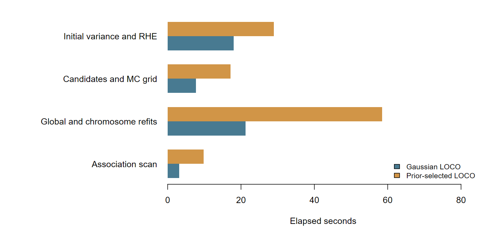

```{r setup, include=FALSE}
knitr::opts_chunk$set(echo=TRUE, eval=FALSE)
```

## The example

This analysis uses the simulated-human genotype panel from the
[gact fine-mapping tutorial](Finemapping_bayesian_linear_regression_simulated_data.html).
We fit ordinary linear regression and two chromosome-excluded background
models with the standalone **glma** R package from the gsuite ecosystem.
All three recorded analyses use the same **5,000 individuals, 37,991 filtered
markers, 22 chromosomes and one simulated phenotype with four causal markers**.
The simulation was frozen with seed 20261005; the phenotype and selected marker
IDs are supplied here so reproducing the analysis does not require rerunning
the simulation or reproducing a particular qgg random-number sequence.

The methods answer the same marker-association question while adjusting for
the genomic background differently:

| Method | Genomic background | Marker test |
| --- | --- | --- |
| `linear` | Fixed covariates | Ordinary regression t test |
| `infinitesimal_loco` | One Gaussian/ridge prior | Scaled residual-offset chi-square test |
| `prior_selected_loco` | Ridge/elastic prior selected using a held-out phenotype subset | Scaled residual-offset chi-square test |

LOCO means leave one chromosome out. For a marker on chromosome 1, the fitted
background excludes chromosome 1. The background therefore does not use that
marker, or nearby markers on its chromosome, to predict away its association.
The LOCO effects and standard errors describe residual-offset tests; they are
not asserted to be exact mixed-model GLS estimates.

## Prepare the same inputs

Use compatible development installations of `gbase` and `glma`. The recorded
Gaussian run used R glma 0.1.0 and native glma 0.1.1. See the
[standalone package and installation guide](https://psoerensen.github.io/gtools/gsuite/docs/source-package-repository.html).
Check the loaded native versions before fitting:

```{r native-versions}
library(gbase)
library(glma)
glma::glma_native_info()
```

If you already have `human.bed`, `human.bim` and `human.fam` from the
fine-mapping tutorial, reuse those files. Downloading and preparing inputs are
separate from the timings below. The following optional code acquires the
original panel and the compact reproducibility files supplied with this page.
It does not download the gact database.

```{r acquire-inputs}
work <- file.path(path.expand("~"), "gact-glma-example")
dir.create(work, recursive=TRUE, showWarnings=FALSE)
genotypes <- "https://raw.githubusercontent.com/psoerensen/qgdata/main/simulated_human_data/"
example <- "https://psoerensen.github.io/gact/Document/glma-simulated-data/"

for (filename in c("human.bed", "human.bim", "human.fam")) {
  dest <- file.path(work, filename)
  if (!file.exists(dest)) download.file(paste0(genotypes, filename), dest, mode="wb")
}
for (filename in c("example-phenotypes.csv", "selected-markers.txt",
                   "causal-markers.txt", "genotype-inputs.csv")) {
  dest <- file.path(work, filename)
  if (!file.exists(dest)) download.file(paste0(example, filename), dest, mode="wb")
}

# Stop if the reference panel has changed since the recorded example.
identity <- read.csv(file.path(work, "genotype-inputs.csv"), stringsAsFactors=FALSE)
observed <- unname(tools::md5sum(file.path(work, identity$file)))
stopifnot(identical(observed, identity$md5))
```

This panel's BIM contains negative genetic-map entries. Make a separate
metadata copy with those entries set to zero, preserving marker identity,
physical position and alleles. Keep the original BIM. This is the same metadata
preparation used in the standalone fine-mapping example.

```{r prepare-glist}
original_bim <- file.path(work, "human.bim")
validated_bim <- file.path(work, "human-validated-map.bim")
if (!file.exists(validated_bim)) {
  bim <- read.table(original_bim, stringsAsFactors=FALSE)
  bim[!is.finite(bim[[3]]) | bim[[3]] < 0, 3] <- 0
  write.table(bim, validated_bim, quote=FALSE, row.names=FALSE, col.names=FALSE)
}

selected <- readLines(file.path(work, "selected-markers.txt"))
phenotypes <- read.csv(file.path(work, "example-phenotypes.csv"),
                       colClasses=c("character", "numeric"))
Glist <- gbase::gprep(study="gact simulated-human example",
  bedfiles=file.path(work, "human.bed"), bimfiles=validated_bim,
  famfiles=file.path(work, "human.fam"), rsids=selected)
stopifnot(identical(unlist(Glist$rsids, use.names=FALSE), selected),
          length(Glist$ids)==5000L, length(selected)==37991L,
          !anyDuplicated(phenotypes$id), setequal(Glist$ids, phenotypes$id))
y <- setNames(phenotypes$phenotype, phenotypes$id)
covariates <- NULL
```

Named phenotypes are aligned to the selected Glist individuals. The package
adds an intercept. Supply other fixed covariates as a numeric matrix with one
row per person and no intercept; named rows allow sample alignment.
Individual-level association reads BED genotypes directly. **Sparse LD and
regional eigensystems are not required for these glma fits.**

## Fit the three methods

Use the same phenotype, Glist, covariates and thread count throughout.
The default automatic structure assessment is retained.

```{r fit-methods}
t_linear <- system.time(
  linear <- glma::glma(y, Glist, covariates=covariates,
                       method="linear", threads=4)
)[["elapsed"]]

t_gaussian <- system.time(
  gaussian <- glma::glma(y, Glist, covariates=covariates,
    method="infinitesimal_loco", algorithm="decoded_full", threads=4)
)[["elapsed"]]

t_prior <- system.time(
  prior <- glma::glma(y, Glist, covariates=covariates,
    method="prior_selected_loco", algorithm="decoded_full", threads=4)
)[["elapsed"]]

data.frame(method=c("linear", "infinitesimal_loco", "prior_selected_loco"),
           elapsed_seconds=c(t_linear, t_gaussian, t_prior))
```

Gaussian LOCO fixes one Gaussian/ridge prior with equal prior variances on
empirically standardized markers. Blocked RHE initializes a three-point Monte
Carlo heritability grid. The resulting global genetic and residual variances
are held fixed for chromosome-excluded refits. Prior-selected LOCO uses the
joint engine to compare ridge and nine elastic candidates, then refits the
selected prior globally and with each chromosome excluded. Shared genotype
reads, cached projected chunk products and warm starts avoid repeating
preparation for each fit. The
[glma workflow guide](https://psoerensen.github.io/gtools/gsuite/docs/glma-workflow.html#account-for-a-genomic-background-with-loco)
documents the approximate variance estimator, stopping rule and grid fallback.

## Inspect association results and fitted backgrounds

```{r inspect-results}
head(gaussian$associations)
gaussian$fit[c("selected_prior", "genetic_variance", "residual_variance")]
gaussian$fit$loco
gaussian$diagnostics
prior$fit$selected_prior
prior$fit$loco

causal <- readLines(file.path(work, "causal-markers.txt"))
gaussian$associations[match(causal, gaussian$associations$marker),
  c("marker", "chromosome", "position", "beta", "se", "statistic", "p", "status")]
```

Each result contains one association row per selected marker, including sample
count, effect, standard error, statistic, p-value and status. Inspect status
before interpreting a row. Both recorded LOCO analyses returned all 37,991
rows with status `ok`, finite p-values and no warnings.

The Gaussian fit selected `ridge`, estimated genetic variance 0.1438813 and
residual variance 1.0062481, and reported heritability 0.1251001. Its grid
bracketed a zero, so `heritability_grid_used_initial` was `FALSE`.
The prior-selected fit selected `elastic_p0.010000_f0.100000`.
Both runs classified the example as low structure and used scaling factor 1.
More strongly structured data can require additional ridge-reference
calibration, which is absent from these timings.


These plots describe this simulated phenotype. They are not a mixed-model
null-calibration study. Download the
[causal-marker results](glma-simulated-data/causal-associations.csv) for the
recorded effects and p-values.

## Several genetic background components

Native glma 0.1.2 adds `sets=sets` for both LOCO methods. Use disjoint named
marker-ID lists; unassigned fitted markers become an automatic `background`
component. For example, collect windows around the known simulated causal
markers into one group and fit the remaining markers as another group:

```{r marker-set-components}
markers <- unlist(Glist$rsids, use.names=FALSE)
chromosome <- unlist(Glist$chr, use.names=FALSE)
position <- unlist(Glist$pos, use.names=FALSE)
causal <- readLines(file.path(work, "causal-markers.txt"))
at <- match(causal, markers)
stopifnot(!anyNA(at))
in_regions <- rep(FALSE, length(markers))
for (i in at) in_regions <- in_regions |
  (chromosome==chromosome[i] & abs(position-position[i])<=1000000)
sets <- list(candidate_regions=markers[in_regions])

components <- glma::glma(y, Glist, sets=sets,
  method="infinitesimal_loco", threads=4)
components$fit$components
components$fit$loco_components

component_prior <- glma::glma(y, Glist, sets=sets,
  method="prior_selected_loco", threads=4)
component_prior$fit$selected_prior
component_prior$fit$components
```

These simulated regions illustrate the interface using known truth. In real
analyses, define biological groups independently of the observed phenotype.
Each group is a separate variance component in one joint background model.
This is not a separate association analysis per set. A common ridge/elastic
family is selected across groups in `prior_selected_loco`, with distinct group
variance scales. Overlapping groups, unknown markers and empty fitted groups
are rejected. This first version requires prepared genotypes and supports
at most 32 components including background.

For group c, `K_c = Z_c Z_c'/m_c` uses empirically standardized genotypes
and its global marker count. Multi-component RHE estimates the groups'
variance profile jointly. The existing scalar Monte Carlo grid refines the
total genetic scale while keeping that profile fixed; this is an approximate
RHE-profile estimator, not multidimensional REML. Raw and adjusted initial
estimates are returned. A reported small positive ridge floor approximates
boundary estimates. LOCO removes the tested chromosome from every component
while retaining the global normalizations and variance parameters. A group
wholly on the excluded chromosome has zero active contribution. Read the
[full component procedure](https://psoerensen.github.io/gtools/gsuite/docs/glma-workflow.html#fit-several-genetic-background-components)
for these definitions and diagnostics.

The component calls above describe the new interface. The following recorded
timings and figures measure the earlier **one-component** analyses only.

## Recorded time and memory

The following are individual completed runs on Windows 11, R 4.4.1, using
four operation-local threads and the same frozen input. Download and initial
Glist preparation are excluded. Each fit ran in a fresh R process.

| Method | R analysis (s) | Whole process (s) | Peak resident memory (MiB) | Sampled peak private memory (MiB) |
| --- | ---: | ---: | ---: | ---: |
| Linear regression | 1.64 | 7.89 | 153.36 | 951.41 |
| Gaussian LOCO | 57.00 | 59.74 | 386.11 | 1,185.20 |
| Prior-selected LOCO | 124.12 | 129.18 | 391.79 | 1,189.91 |

Whole-process time includes startup, loading the fixture and serialization.
Resident memory is the peak Windows working set. Sampled private memory is
private committed memory and is a separate measure; it is not resident memory
or an additional amount to add to it. These are one-run observations rather
than averaged benchmarks or projections to larger datasets. Linear regression
and prior-selected LOCO were measured with native glma 0.1.0; the replacement
Gaussian route was measured with native glma 0.1.1. R glma was 0.1.0 throughout.
The retired slow infinitesimal run never completed and provides no speedup
denominator.



| Phase | Gaussian LOCO (s) | Prior-selected LOCO (s) |
| --- | ---: | ---: |
| Initial variance preparation and RHE | 18.00 | 28.93 |
| Candidates and Monte Carlo grid | 7.67 | 17.15 |
| Global and chromosome-excluded refits | 21.26 | 58.46 |
| Total native prediction fit | 46.93 | 104.56 |
| Association scan | 3.12 | 9.79 |

The fit total includes the first three phases. R analysis additionally includes
structure assessment, preparation and wrapper work. Do not add the fit total
to its component phases. Chromosome refits were the largest measured fitting
phase. Prior-selected LOCO performs more fitting work than Gaussian LOCO, so
the difference is not a speed comparison of equivalent estimators.

## Reproducibility files

- [Frozen phenotype with sample IDs](glma-simulated-data/example-phenotypes.csv)
- [Selected marker IDs](glma-simulated-data/selected-markers.txt)
- [Causal marker IDs](glma-simulated-data/causal-markers.txt)
- [Genotype input sizes and MD5 identities](glma-simulated-data/genotype-inputs.csv)
- [Recorded timing and memory table](glma-simulated-data/timings.csv)
- [Recorded phase timings](glma-simulated-data/phase-timings.csv)
- [Recorded causal-marker associations](glma-simulated-data/causal-associations.csv)

The Gaussian implementation passed focused native comparisons with independently
computed dense global and chromosome-excluded Gaussian solutions, and focused
standalone R checks. Complete source-package qualification and a broad
mixed-model null-tail calibration study remain open. The supplied results and
timings describe the measured one-component workflows.
