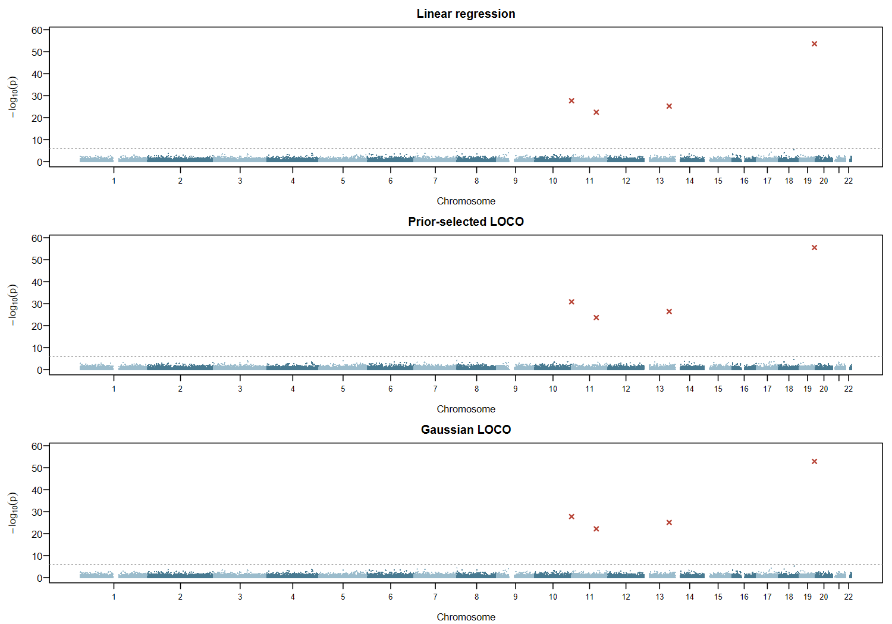

```{r setup, include=FALSE}
knitr::opts_chunk$set(echo=TRUE, eval=FALSE)
```

<style>
table { width: 100%; font-variant-numeric: tabular-nums; }
th, td { padding: 9px 12px !important; }
thead { background: #f3f6f8; }
tbody tr:nth-child(even) { background: #f8fafb; }
</style>

## Introduction

This example uses **glma** to fit linear regression and two LOCO mixed-model
association methods to the simulated-human panel from the
[fine-mapping example](Finemapping_bayesian_linear_regression_simulated_data.html).
The recorded analysis uses 5,000 individuals, 37,991 filtered markers on
22 chromosomes and one simulated phenotype with four causal markers.

## Prepare the data

Choose an existing working directory. Download the simulated PLINK files,
prepare Glist and apply the usual marker filters. Use gbase 0.1.1 or later and
a compatible [glma installation](https://psoerensen.github.io/gtools/gsuite/docs/source-package-repository.html).
The example supplies a BIM file with 13 invalid genetic-map values corrected;
marker identities, positions, alleles and BED genotypes are unchanged.

```{r prepare}
library(gbase)
library(glma)

setwd("C:/Users/Projects/Examples")
url <- "https://github.com/psoerensen/qgdata/raw/main/simulated_human_data/"
base <- "https://psoerensen.github.io/gact/Document/glma-simulated-data/"

# Download the simulated genotype data.
download.file(paste0(url, "human.bed"), "human.bed", mode="wb")
download.file(paste0(base, "human.bim"), "human.bim")
download.file(paste0(url, "human.fam"), "human.fam")

# Prepare Glist and filter markers.
Glist <- gprep(study="Simulation", bedfiles="human.bed",
  bimfiles="human.bim", famfiles="human.fam")
rsids <- gfilter(Glist, maf=0.05, missing=0.05, hwe=1e-12,
  ambiguous=TRUE, indels=TRUE, mhc=FALSE)
Glist <- gprep(study="Simulation", bedfiles="human.bed", rsids=rsids)

# Load the example phenotype.
phenotypes <- read.csv(paste0(base, "example-phenotypes.csv"),
  colClasses=c("character", "numeric"))
y <- setNames(phenotypes$phenotype, phenotypes$id)
```

Named phenotypes are aligned to the Glist individuals. The package adds an
intercept; optional fixed covariates can be supplied as `covariates=X`, with
sample IDs as row names and no intercept column. These fits read BED genotypes directly and require
no sparse LD or regional eigensystems.

## Fit linear regression and LOCO models

```{r fit-methods}
# Ordinary linear regression.
linear <- glma(y, Glist, method="linear", threads=4)

# Gaussian/ridge background.
gaussian <- glma(y, Glist, method="infinitesimal_loco", threads=4)

# Select a ridge/elastic prior using held-out phenotypes.
prior <- glma(y, Glist, method="prior_selected_loco", threads=4)

head(gaussian$associations)
gaussian$fit[c("selected_prior", "genetic_variance", "residual_variance")]
prior$fit$selected_prior
```

LOCO means leave one chromosome out: the background for each marker excludes
its chromosome. Both LOCO methods use an approximate RHE/Monte Carlo variance
procedure and hold the fitted variance parameters fixed for chromosome refits.
Their association statistics are scaled residual-offset chi-square tests;
the returned effects and standard errors describe those tests.
See the [glma workflow guide](https://psoerensen.github.io/gtools/gsuite/docs/glma-workflow.html#account-for-a-genomic-background-with-loco)
for the estimation procedure and diagnostics.

## Association results

Each row contains the marker's effect, standard error, statistic, p-value and
status. Inspect `status` before interpreting results. The recorded LOCO runs
returned all 37,991 markers with status `ok`.



These results illustrate the simulated phenotype. Broader mixed-model null-tail
calibration and complete source-package qualification remain open.

## Several genetic background components

Supply each chromosome as a named marker set. The model fits one variance
component per chromosome:

```{r components}
sets <- getChromosomeSets(Glist)

components <- glma(y, Glist, sets=sets,
  method="infinitesimal_loco", threads=4)
components$fit$components

component_prior <- glma(y, Glist, sets=sets,
  method="prior_selected_loco", threads=4)
component_prior$fit$components
```

The groups enter one joint background model. Prior-selected LOCO chooses one
prior family across groups with separate variance scales. For real data, define
groups independently of the observed phenotype. This interface uses prepared
genotypes and supports at most 32 components, including background.
The [component guide](https://psoerensen.github.io/gtools/gsuite/docs/glma-workflow.html#fit-several-genetic-background-components)
describes the approximate variance estimator and LOCO normalizations.

## Time and memory

Recorded one-component fits on Windows 11 with R 4.4.1 and four threads.
Time covers the R analysis; downloading, data preparation and process startup
are excluded. Memory is the whole R process's peak resident working set.
These simulated data had low structure; other datasets can require additional
automatic calibration. The component examples above have no recorded timings.

| Method | Time | Peak resident memory |
| :--- | ---: | ---: |
| Linear regression | 1.64 s | 153 MiB |
| Gaussian LOCO | 57.00 s | 386 MiB |
| Prior-selected LOCO | 124.12 s | 392 MiB |
