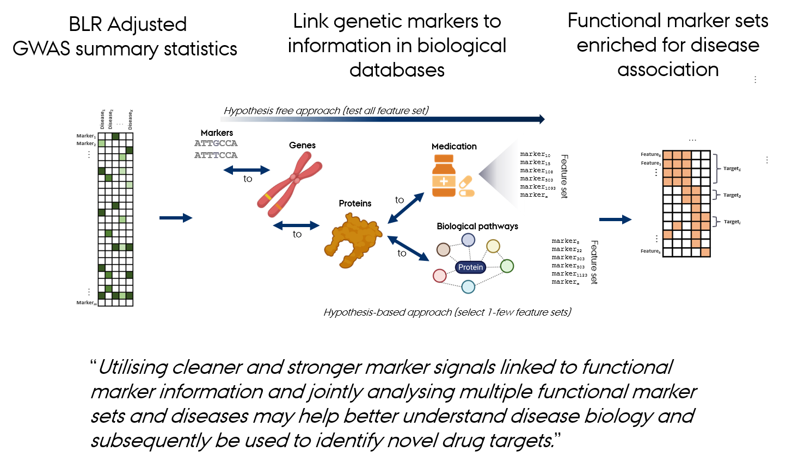

<!-- README.md is generated from README.Rmd. Please edit that file -->

```{r, echo = FALSE}
knitr::opts_chunk$set(
  collapse = TRUE,
  comment = "#>",
  fig.path = "README-"
)
```

### An R Package for Creating a Database of Genomic Association of Complex Traits


The R package ***gact*** is designed for establishing and populating a comprehensive database focused on genomic associations with complex traits. The package serves two primary functions: infrastructure creation and data acquisition. It facilitates the assembly of a structured repository that includes single marker associations, carefully curated to maintain high data quality. Beyond individual genetic markers, the package integrates a broad spectrum of genomic entities, encompassing genes, proteins, and an array of biological complexes (chemical and protein), as well as various biological pathways. It is designed to aid in the biological interpretation of genomic associations, shedding light on their complex relationships in the context of genomic associations of complex traits.

**gact** provides an infrastructure for efficient processing of large-scale genomic association data, including core functions for:  
 
* Establishing and populating a database for genomic association.
* Downloading and processing a range of biological databases.
* Downloading and processing summary statistics from genome-wide association studies (GWAS).
* Conducting bioinformatic procedures to link genetic markers with genes, proteins, metabolites, and biological pathways.
* Finemapping of genomic regions using Bayesian Linear Regression models.
* Performing advanced gene set enrichment analysis utilizing a variety of tools and methodologies.

<br>



<br>


<br>

**gact** constructs gene and genetic marker sets from a range of biological databases including: 

- `"Ensembl"`: Gene, protein, transcript sets derived from the [Ensembl](https://www.ensembl.org/index.html) database.
- `"Regulation"`: Regulatory genomic feature sets derived from the [Ensembl Regulation](https://www.ensembl.org/info/genome/funcgen/index.html) database.
- `"GO"`: Gene Ontology sets from the [GO](https://geneontology.org) database.
- `"Pathways"`: Pathway sets from the [Reactome](https://reactome.org) and [KEGG](https://www.genome.jp/kegg/pathway.html) databases.
- `"ProteinComplexes"`: Protein complex sets derived from the [STRING](https://string-db.org) database.
- `"ChemicalComplexes"`: Chemical complex sets derived from the [STITCH](http://stitch.embl.de/) database. 
- `"DrugGenes"`: Drug-gene interaction sets the [DrugBank](https://go.drugbank.com) database.
- `"DrugATCGenes"`: Drug ATC gene sets based on the [ATC](https://www.whocc.no/atc_ddd_index/) and [DrugBank](https://go.drugbank.com) databases.
- `"DrugComplexes"`: Drug gene complex sets combining information from [STRING](https://string-db.org) and [DrugBank](https://go.drugbank.com).
- `"DiseaseGenes"`: Disease-gene sets based on experiments, textmining and knowledge base derived from the [DISEASE](https://diseases.jensenlab.org/Search) database.
- `"GTEx"`: GTEx project eQTL sets derived from the [GTEx](https://www.gtexportal.org/home/downloads/adult-gtex/overview) database.
- `"GWAScatalog"`: GWAS catalog sets derived from the [GWAScatalog](https://www.ebi.ac.uk/gwas/) database.
- `"VEP"`: Variant Effect Predictor sets derived from the [Ensembl Variant Effect Predictor](https://grch37.ensembl.org/info/docs/tools/vep) database.

<br>


### Installation of the gact package

To install the most recent version of the gact and qgg package from GitHub, use the following commands in R:
```{r,  eval=FALSE, echo=TRUE}
library(devtools)
devtools::install_github("psoerensen/gact")
devtools::install_github("psoerensen/qgg")
```

### Tutorials for downloading and installing the gact database
Below is a set of tutorials used for the gact package:  

Download and set up the gact database, which is focused on genomic associations for complex traits:   
[Download and install gact database](Document/Download_and_install_gact_database.html)  

Downloading and processing genome-wide association summary statistic and ingest into database:   
[Download and process new gwas summary statistics](Document/Download_and_process_gwas.html)  

Download and process genotype data from the 1000 Genomes Project (1000G) for different ancestries (European, East Asian, South Asian) used in different genomic analysis:   
[Download and process of 1000G data](Document/Process_1000G.html)  

Computing sparse Linkage Disequilibrium (LD) matrices for 1000 Genomes Project (1000G) data across different ancestries and exploring the LD data which is used in a number of genomic analysis (LD score regression, Vegas gene analysis, Bayesian Linear Regression models):   
[Compute sparse LD matrices for 1000G data](Document/Compute_sparseLD_1000G.html)  


### Tutorials for various types of genomic analysis using the gact database 

Gene analysis using the VEGAS (Versatile Gene-based Association Study) approach using the 1000G LD reference data processed above:   
[Gene analysis using VEGAS](Document/Gene_analysis_vegas.html)  

Gene set enrichment analysis (GSEA) based on BLR (Bayesian Linear Regression) model derived gene-level statistics and MAGMA (Multi-marker Analysis of GenoMic Annotation) (Bai et al. 2024).   
[Gene set analysis using MAGMA](Document/Gene_set_analysis__magma.html)  

Pathway prioritization using a single and multiple trait Bayesian MAGMA models and gene-level statistics derived from VEGAS (Gholipourshahraki et al. 2024).   
[Gene set analysis using Bayesian MAGMA](Document/Gene_set_analysis_bayesian_magma.html)  

Polygenic Prioritization Scoring (PoPS) using BLR models and gene-level statistics derived from VEGAS (work in progress).   
[Gene ranking using PoPS](Document/Gene_set_analysis_bayesian_magma.html)  

Finemapping of gene and LD regions using single trait Bayesian Linear Regression models (Shrestha et al. 2023).    
[Finemapping using BLR models](Document/Finemapping_gene_regions_blr.html)  

<!-- Finemapping of LD regions using single trait Bayesian Linear Regression models (Shrestha et al. 2023).     -->
<!-- [Finemapping of LD regions using BLR models](Document/Finemapping_ld_regions_blr.html)   -->

LD score regression for estimating genomic heritability and correlations.    
[LD score regression](Document/LD_score_regression.html)  


#### Funding  
These notes and scripts are prepared in the BALDER project funded by the ODIN platform. ODIN is sponsored by the Novo Nordisk Foundation (grant number NNF20SA0061466)

#### References  

1. Rohde PD, Sørensen IF, Sørensen P. 2020. qgg: an R package for large-scale quantitative genetic analyses. *Bioinformatics* 36:8. doi.org/10.1093/bioinformatics/btz955  

2. Rohde PD, Sørensen IF, Sørensen P. 2023. Expanded utility of the R package, qgg, with applications within genomic medicine. *Bioinformatics* 39:11. doi.org/10.1093/bioinformatics/btad656  

3. Shrestha et al. 2023. Evaluation of Bayesian Linear Regression Models as a Fine Mapping Tool. *Submitted* doi.org/10.1101/2023.09.01.555889  

4. Bai et al. 2024. Evaluation of multiple marker mapping methods using single trait Bayesian Linear Regression models. *In preparation*  

5. Gholipourshahraki et al. 2024. Evaluation of Bayesian Linear Regression Models for Pathway Prioritization. *In preparation*  


<!-- ### Need -->
<!-- The genomic research community is accumulating vast quantities of data on genomic associations with complex traits at an unprecedented pace. The primary challenges are the complexity of biologically interpreting genomic data and the absence of a unified repository capable of supporting both the storage of diverse genomic information and complex bioinformatic analyses. This repository is essential for facilitating the interpretation of large-scale genomic association data, bridging the gap between data collection and biological understanding. -->


<!-- ### Approach -->
<!-- We provide a streamlined solution that enhances research efficiency and fosters a deeper biological comprehension of genomic associations, addressing both current challenges and enabling future discoveries by providing: -->

<!-- * Infrastructure Creation: Establishes an accessible, structured database for genomic data, ensuring ease of organization and access. -->

<!-- * Data Acquisition: Automates the collection and integration of biological databases and GWAS summary statistics, simplifying the assembly of diverse genomic data. -->

<!-- * Bioinformatic Analysis: Offers tools for linking genetic markers to genes, proteins, and pathways, facilitating a deeper genetic understanding of complex traits. -->

<!-- * Advanced Analytical Tools: Supports precise genomic region mapping and enrichment analysis, enhancing the analysis of genetic contributions to complex traits. -->


<!-- ### Benefit -->
<!-- Our solution's benefits collectively enhance the capacity for advanced genomic research, making our software a valuable tool for uncovering deeper insights into complex traits and driving forward the field of genomics. -->

<!-- * Comprehensive Genomic Analysis: Enables detailed studies of complex traits through efficient data processing and analysis tools, allowing for more in-depth research outcomes. -->

<!-- * Streamlined Workflow: Automates data handling, saving considerable time and resources, thus facilitating more ambitious genomic research projects. -->

<!-- * Enhanced Data Quality: Ensures the reliability of research findings through meticulous curation and sophisticated analytical techniques, raising the standard of data integrity. -->

<!-- * Innovative Research Opportunities: Opens the door to groundbreaking studies by integrating diverse bioinformatic tools and methodologies, fostering innovation in genomic research. -->


<!-- ### Competition -->
<!-- Compared to other genomic databases and analysis tools, our software stands out due to its: -->

<!-- * All-encompassing Approach: It not only compiles an extensive range of genomic data but also provides advanced tools for bioinformatic analysis and interpretation, offering a more holistic solution for genomic research. -->

<!-- * Automation and Efficiency: The package's ability to automate the downloading, processing, and analysis of complex genomic data sets it apart, enhancing research efficiency. -->

<!-- * Quality and Reliability: Emphasizing rigorous data curation and the use of advanced analytical techniques ensures that the gact package meets the highest standards of data integrity and research validity. -->

<!-- In summary, our software addresses the critical needs of the genomic research community by providing an integrated, efficient, and high-quality platform for exploring genomic associations with complex traits, significantly advancing the potential for discovery and innovation in the field. -->
