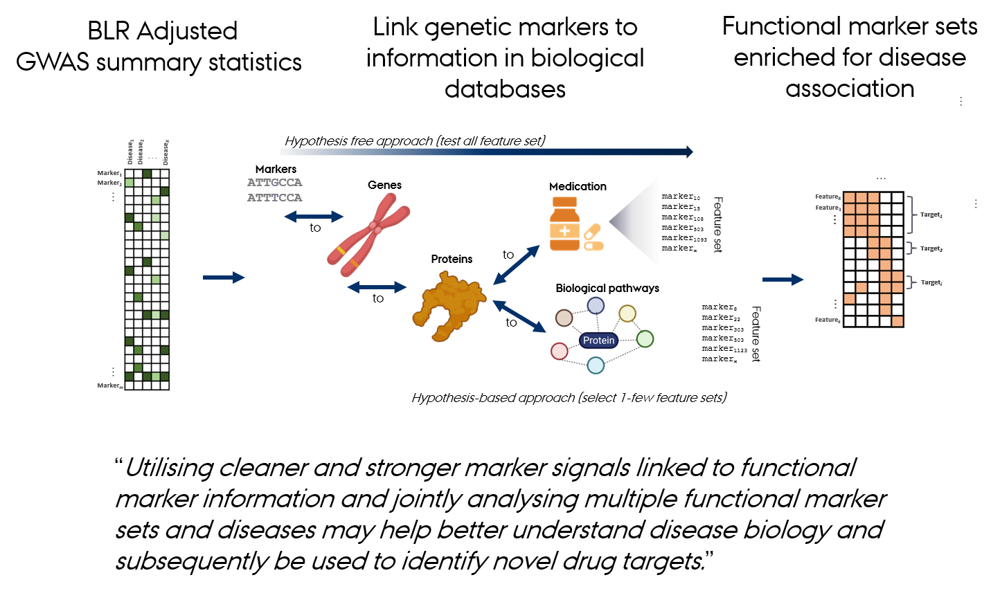

<!-- README.md is generated from README.Rmd. Please edit that file -->

### An R Package for Creating a Database of Genomic Associations of Complex Traits

The R package ***gact*** is designed for establishing and populating a
comprehensive database focused on genomic associations with complex
traits. The package serves two primary functions: infrastructure
creation and data acquisition. It facilitates the assembly of a
structured repository that includes single marker associations,
carefully curated to maintain high data quality. Beyond individual
genetic markers, the package integrates a broad spectrum of genomic
entities, encompassing genes, proteins, and an array of biological
complexes (chemical and protein), as well as various biological
pathways. It is designed to aid in the biological interpretation of
genomic associations, shedding light on their complex relationships in
the context of genomic associations of complex traits.

**gact** provides an infrastructure for efficient processing of
large-scale genomic association data, including core functions for:

- Establishing and populating a database for genomic association.
- Downloading and processing a range of biological databases.
- Downloading and processing summary statistics from genome-wide
  association studies (GWAS).
- Conducting bioinformatic procedures to link genetic markers with
  genes, proteins, metabolites, and biological pathways.
- Finemapping of genomic regions using Bayesian Linear Regression
  models.
- Performing advanced gene set enrichment analysis utilizing a variety
  of tools and methodologies.

<br>

 <br>

<br>

**gact** constructs gene and genetic marker sets from a range of
biological databases including:

- `"Ensembl"`: Gene, protein, transcript sets derived from the
  [Ensembl](https://www.ensembl.org/index.html) database.
- `"Regulation"`: Regulatory genomic feature sets derived from the
  [Ensembl
  Regulation](https://www.ensembl.org/info/genome/funcgen/index.html)
  database.
- `"GO"`: Gene Ontology sets from the [GO](https://geneontology.org)
  database.
- `"Pathways"`: Pathway sets from the [Reactome](https://reactome.org)
  and [KEGG](https://www.genome.jp/kegg/pathway.html) databases.
- `"ProteinComplexes"`: Protein complex sets derived from the
  [STRING](https://string-db.org) database.
- `"ChemicalComplexes"`: Chemical complex sets derived from the
  [STITCH](http://stitch.embl.de/) database.
- `"DrugGenes"`: Drug-gene interaction sets the
  [DrugBank](https://go.drugbank.com) database.
- `"DrugATCGenes"`: Drug ATC gene sets based on the
  [ATC](https://www.whocc.no/atc_ddd_index/) and
  [DrugBank](https://go.drugbank.com) databases.
- `"DrugComplexes"`: Drug gene complex sets combining information from
  [STRING](https://string-db.org) and
  [DrugBank](https://go.drugbank.com).
- `"DiseaseGenes"`: Disease-gene sets based on experiments, textmining
  and knowledge base derived from the
  [DISEASE](https://diseases.jensenlab.org/Search) database.
- `"GTEx"`: GTEx project eQTL sets derived from the
  [GTEx](https://www.gtexportal.org/home/downloads/adult-gtex/overview)
  database.
- `"GWAScatalog"`: GWAS catalog sets derived from the
  [GWAScatalog](https://www.ebi.ac.uk/gwas/) database.
- `"VEP"`: Variant Effect Predictor sets derived from the [Ensembl
  Variant Effect
  Predictor](https://grch37.ensembl.org/info/docs/tools/vep) database.

<br>

### Installation of the gact package

Install gact from GitHub and the standalone gsuite analysis packages
with:

``` r
options(repos=c(
  gsuite="https://psoerensen.github.io/gtools/gsuite/repository",
  CRAN="https://cloud.r-project.org"
))
devtools::install_github("psoerensen/gact")
gact::install_gsuite()
```

### Tutorials for downloading and installing the gact database

Below is a set of tutorials used for the gact package:

Download, save and reopen the gact database, inspect its contents, and
review storage and timing information:

[Download and install gact
database](Document/Download_and_install_gact_database.html)

Download and process genotype data from the 1000 Genomes Project (1000G)
for different ancestries (European, East Asian, South Asian) used in
different genomic analysis:  
[Download and process of 1000G data](Document/Process_1000G.html)

Computing sparse Linkage Disequilibrium (LD) matrices for 1000 Genomes
Project (1000G) data across different ancestries and exploring the LD
data which is used in a number of genomic analysis (LD score regression,
Vegas gene analysis, Bayesian Linear Regression models):  
[Compute sparse LD matrices for 1000G
data](Document/Compute_sparseLD_1000G.html)

Downloading and processing genome-wide association summary statistic and
ingest into database:  
[Download and process new GWAS summary
statistics](Document/Download_and_process_gwas.html)

### Tutorials for various types of genomic analysis using the gact database

Check summary statistics against reference LD and impute missing
Z-scores for multiple studies:

[Summary-statistics imputation](Document/Impute_summary_statistics.html)

Gene analysis using the VEGAS (Versatile Gene-based Association Study)
approach using the 1000G LD reference data processed above:  
[Gene analysis using VEGAS](Document/Gene_analysis_vegas.html)

Gene set enrichment analysis (GSEA) based on BLR (Bayesian Linear
Regression) model derived gene-level statistics and MAGMA (Multi-marker
Analysis of GenoMic Annotation) (Bai et al. 2024).  
[Gene set analysis using MAGMA](Document/Gene_set_analysis_magma.html)

Pathway prioritization using a single and multiple trait Bayesian MAGMA
models and gene-level statistics derived from VEGAS (Gholipourshahraki
et al. 2024).  
[Gene set analysis using Bayesian
MAGMA](Document/Gene_set_analysis_bayesian_magma.html)

Gene ranking with chromosome-held-out ridge, BayesC and BayesR PoPS
models using gene-level statistics derived from VEGAS.

[Gene ranking using PoPS](Document/Gene_ranking_bayesian_pops.html)

Individual-level linear regression and LOCO mixed-model association
using the standalone glma package on the same simulated-human panel:
[Linear regression and LOCO mixed models with
glma](Document/Glma_linear_and_mixed_models_simulated_data.html)

Individual-level BayesC and BayesR, full and scheduled marker updates,
held-out prediction and genetic variance decomposition on sparse and
polygenic simulated traits: [Individual-level Bayesian regression with
gbayes](Document/Gbayes_individual_level_simulated_data.html)

Finemapping with single trait Bayesian Linear Regression models and
simulated data (Shrestha et al. 2023).  
[Finemapping using BLR models on simulated
data](Document/Finemapping_bayesian_linear_regression_simulated_data.html)

Finemapping of gene and LD regions using single trait Bayesian Linear
Regression models (Shrestha et al. 2023).  
[Finemapping using BLR models on real
data](Document/Finemapping_bayesian_linear_regression_real_data.html)

Polygenic scoring (PGS) using Bayesian Linear Regression models and
biological pathway information (work in progress).  
[Polygenic scoring using BLR
models](Document/Polygenic_scoring_bayesian_linear_regression.html)

Polygenic scoring (PGS) using summary statistics from PGS catalog and
biological pathway information.  
[Polygenic scoring using PGS
Catalog](Document/Polygenic_scoring_pgscatalog.html)

LD score regression for estimating genomic heritability and
correlations.  
[LD score regression](Document/LD_score_regression.html)

CAD/T2D genetic correlation with standalone gcorr: stored LD scores,
regional HESS/rho-HESS, timing and memory.

[Genetic correlation with
gcorr](Document/Genetic_correlation_CAD_T2D_gcorr.html)

[Tutorial timings and memory](Document/Tutorial_timings_and_memory.html)

### Workflow requirements and interpretation

Use a genetic reference panel matched to the GWAS ancestry and genome
build. The default database uses GRCh37; summary statistics from another
build require coordinate conversion and checks of marker identity and
allele orientation before ingestion. Review the mappings returned by
`detectStatSchema()` and provide an explicit schema when a required
field is ambiguous. `normalizeStatSchema()` and `validateStatSchema()`
support checking the resulting canonical fields before writing to the
database.

The analysis tutorials use the standalone gsuite R packages with
familiar qgg-style arguments. gact imports gbase for shared preparation
and marker-set helpers; `install_gsuite()` installs the analysis
packages explicitly. BLR-MAGMA in these tutorials is the Bayesian
gene-set workflow; it is distinct from running the standalone MAGMA
executable. PoPS prioritizes genes and does not produce individual
polygenic scores. Fine-mapping and polygenic-scoring examples have
different inputs and model controls; retain the arguments and
diagnostics for each run. Successful execution alone does not establish
MCMC convergence.

For optional LD consistency checking and missing Z-score imputation,
keep gaps when extracting statistics and use an ancestry-matched Glist
reference:

``` r
stat <- getMarkerStat(GAlist, studyID=c("GWAS1", "GWAS2"), rm.na=FALSE)
stat <- gbase::checkStat(Glist, stat, ldcheck=TRUE, impute=TRUE)
```

The same call handles all trait columns. Accepted observed scores remain
intact; poor-quality predictions stay missing. See the [summary
preparation
guide](https://psoerensen.github.io/gtools/gsuite/docs/genotype-preparation.html#summary-statistics-checking-and-imputation)
for ancestry groups, explicit meta-analysis mixtures and diagnostic
flags. The [gact imputation
example](Document/Impute_summary_statistics.html) shows the CAD/T2D
workflow. Missing sample sizes and effect estimates are not inferred.

Reference preparation, LD computation, model fitting, and scoring have
separate resource requirements. Check disk and memory capacity before
computing genome-wide LD. Runtime depends on marker counts, reference
sample size, model settings, and thread limits. Measurements of a
tutorial example do not establish completion of every analysis reported
in a manuscript.

### Workshop and Course Materials

**Workshop:**  
*From Integrative Genomics to Polygenic Risk Scoring* — presented at the
[**9th Annual Danish Bioinformatics
Conference**](https://eventsignup.ku.dk/9danishbioinfconference).

- [**Workshop Slides (HTML)**](Document/workshop_slides.html)  
- [**Demonstration Slides (PDF)**](Document/workshop_slides.pdf)

**Course:**  
*Bayesian Linear Regression* — theoretical notes, lecture slides, and
practical R examples.  
[**Course
Materials**](https://psoerensen.github.io/bayesian-linear-regression/)

#### Funding

These notes and scripts are prepared in the BALDER project funded by the
ODIN platform. ODIN is sponsored by the Novo Nordisk Foundation (grant
number NNF20SA0061466)

#### References

1.  Rohde PD, Sørensen IF, Sørensen P. qgg: an R package for large-scale
    quantitative genetic analyses. *Bioinformatics* 36:8 (2020).
    <https://doi.org/10.1093/bioinformatics/btz955>

2.  Rohde PD, Sørensen IF, Sørensen P. Expanded utility of the R
    package, qgg, with applications within genomic medicine.
    *Bioinformatics* 39:11 (2023).
    <https://doi.org/10.1093/bioinformatics/btad656>

3.  Shrestha et al. Evaluation of Bayesian Linear Regression Models as a
    Fine Mapping Tool. *Submitted* (2024)
    <https://doi.org/10.1101/2023.09.01.555889>

4.  Bai et al. Evaluation of multiple marker mapping methods using
    single trait Bayesian Linear Regression models. *BMC Genomics*
    25:1236 (2024). <https://doi.org/10.1186/s12864-024-11026-2>

5.  Gholipourshahraki et al. Evaluation of Bayesian Linear Regression
    Models for Pathway Prioritization. *PLOS Genetics* 20(11) e1011463
    (2025). <https://doi.org/10.1371/journal.pgen.1011463>.

6.  Kunkel et al. Improving polygenic prediction from summary data by
    learning patterns of effect sharing across multiple phenotypes.
    *Plos Genetics* 21 (1), e1011519 (2025).
    <https://doi.org/10.1371/journal.pgen.1011519>.
